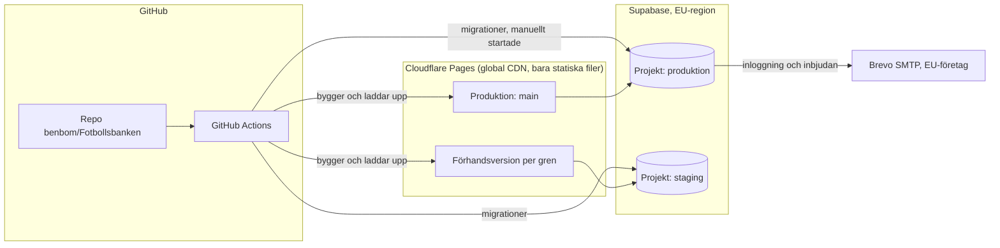

# 0002: Hosting, drift och kostnad

Status: föreslagen

## Kontext

ADR 0001 gör appen till en statisk SPA med Supabase som backend. Nu ska det bestämmas var appen och databasen körs, hur e-post skickas och hur CI och förhandsversioner fungerar. Följande krav gäller:

- **Drift på gratisnivåer.** Nya kostnader kräver användarens beslut (`CLAUDE.md`, `kravspec.md`).
- **Appen drivs av en ideell förening.** Vissa gratisnivåer gäller bara privat eller icke-kommersiellt bruk, och villkoren måste därför kontrolleras.
- **Personuppgifter ska lagras inom EU.** Det gäller i praktiken ledarnas konton: namn, e-post och medlemskap. Inga uppgifter om spelare lagras (`kravspec.md`).
- **E-post** behövs för inloggning och inbjudningar (berättelse 08 och 11, ADR 0004).
- **CI med GitHub Actions** och en förhandsversion per gren (uppdraget för fas 2). `main` ska alltid fungera (`CLAUDE.md`).
- **Förutsägbar användning.** Användningen är låg men säsongsbunden: en klubb först, ledare som planerar veckovis och uppehåll i vinter- och sommaruppehållen.
- **Repot `benbom/Fotbollsbanken` är privat** (kontrollerat med `gh repo view` 2026-09-11). Det påverkar vad GitHub ger gratis.

### Villkor för gratisnivåerna

Uppgifterna hämtades 2026-09-11. Källorna står i slutet.

| Tjänst | Gratisnivå | Villkor för kommersiellt bruk | När gränsen nås |
|---|---|---|---|
| **Supabase Free** | 500 MB databas, 5 GB egress (plus 5 GB cachad), 50 000 aktiva användare per månad, 1 GB fillagring, 500 000 anrop till Edge Functions, högst 2 aktiva projekt. Inga automatiska säkerhetskopior. Branching ingår inte. | Prissidan nämner ingen begränsning till icke-kommersiellt bruk. Användarvillkoren har inte lästs i sin helhet. | Först ett meddelande och en frist. Den som fortsätter överskrida kan få projekten pausade, databasen skrivskyddad eller svar med HTTP 402 på alla API-anrop. Fristen ges bara en gång. |
| **Supabase, paus vid inaktivitet** | Ett gratisprojekt pausas efter en vecka utan tillräcklig databasaktivitet. Enligt dokumentationen räcker ”a few user requests to the database each day”. | – | Ett pausat projekt kan återställas från dashboarden i upp till ett år, med data och inställningar kvar. En äldre changelog anger 90 dagar, men den aktuella dokumentationssidan anger ett år. |
| **Supabase, inbyggd e-post** | Skickar bara till adresser i projektets team, högst 2 meddelanden per timme. Supabase avråder från den i produktion. | – | Meddelanden till andra adresser skickas inte. |
| **Supabase med egen SMTP** | Startar på 30 meddelanden per timme och kan höjas i inställningarna för gränser. | – | Meddelanden över gränsen avvisas. |
| **Cloudflare Pages Free** | 500 byggen per månad, 1 bygge åt gången, 20 000 filer och 25 MiB per fil, obegränsat antal förhandsversioner. Gränssidan anger ingen bandbreddsgräns för statiska filer. | Gränssidan nämner ingen begränsning till icke-kommersiellt bruk. | Byggen över kvoten körs inte. |
| **Vercel Hobby** | Generösa kvoter. | **”the Hobby plan restricts users to non-commercial, personal use only”** | Funktionen spärras i 30 dagar. |
| **Brevo Free** | 300 e-postmeddelanden per dag, SMTP och API ingår. | Ingen begränsning hittades. | Upp till 1 000 transaktionsmeddelanden läggs i en kö för nytt försök, och de som inte ryms i kön levereras inte. |
| **Resend Free** | 3 000 meddelanden per månad, högst 100 per dag, 3 domäner, loggar sparas i 30 dagar. | Nämns inte. | Anges inte. |
| **GitHub Actions (GitHub Free, privat repo)** | 2 000 minuter och 500 MB lagring för artefakter per månad. Publika repon är gratis. | – | Utan betalmetod blockeras körningar när kvoten är slut. |

## Beslut

### Driftöversikt

1. **Webbhotell: Cloudflare Pages Free** för det statiska bygget. Varje gren får en egen förhandsadress (`<gren>.<projekt>.pages.dev`). Produktionen körs från `main`. En egen domän är valfri, se *Beslut som behövs*.
2. **Databas, Auth och Edge Functions: Supabase Free** i en EU-region. Förstahandsval är `eu-north-1` (Stockholm), annars `eu-central-1` (Frankfurt). Tillgängliga regioner kontrolleras när projektet skapas. Två projekt, som ryms i gratisnivåns två aktiva projekt:
   - **produktion**, som bara `main` pekar på
   - **staging**, som alla förhandsversioner pekar på, med testdata och aldrig riktiga personuppgifter
   
   Utveckling och CI använder en lokal Supabase i Docker (`supabase start`), som inte kostar något och inte räknas mot kvoterna.
3. **E-post: Brevo Free som egen SMTP i Supabase Auth.** Brevo ger 300 meddelanden per dag, vilket är mer än Resends 100, och är ett franskt företag. Innan Brevo tas i drift ska det bekräftas i Brevos personuppgiftsbiträdesavtal var datan lagras. Säkerhetsagenten granskar det. Supabase Auths gräns sätts till en nivå under Brevos dagsgräns, se ADR 0004.
4. **CI: GitHub Actions** med följande jobb:
   - **Varje push till en gren:** `tsc --noEmit`, ESLint, Vitest, bygge, och uppladdning av en förhandsversion till Cloudflare med `wrangler pages deploy --branch=<gren>`. En Cloudflare-token med minsta möjliga behörighet (bara Pages) sparas som hemlighet i GitHub.
   - **Pull request mot `main` och ändringar under `supabase/`:** pgTAP-tester mot lokal Supabase i Docker.
   - **Pull request mot `main` och ändringar under `src/`:** Playwright med axe mot bygget.
   - **Merge till `main`:** allt ovan, uppladdning till produktion och migrationer till staging.
   - **Migrationer till produktion:** körs med ett manuellt startat arbetsflöde (`workflow_dispatch`) efter kontrollpunkten, aldrig automatiskt.
   - `concurrency` med `cancel-in-progress` avbryter överflödiga körningar, och npm-cachen och Playwrights webbläsare cachas för att spara minuter.
   
   Uppladdningen sker från GitHub Actions i stället för med Cloudflares Git-integration. Då laddas bara det upp som har klarat testerna, och Cloudflare behöver ingen läsbehörighet till repot.
5. **Hålla databasen vaken (förslag, kräver beslut):** ett schemalagt arbetsflöde i GitHub Actions gör en lätt läsning mot produktionens databas en gång per dag, så att projektet inte pausas under uppehåll. Det kostar ungefär 30 Actions-minuter i månaden. Se *Beslut som behövs*.
6. **Säkerhetskopior (förslag, kräver säkerhetsagentens granskning):** Supabase Free har inga säkerhetskopior. Ett schemalagt arbetsflöde kör `supabase db dump` en gång i veckan och krypterar filen innan den sparas som artefakt i Actions, med kort lagringstid (till exempel 30 dagar). Filen innehåller ledarnas personuppgifter och får aldrig sparas okrypterad. Nyckeln förvaras utanför repot.
7. **Övervakning av kvoter:** den som äger Supabase- och Cloudflare-kontona läser de e-postmeddelanden som skickas när en kvot närmar sig. Någon betald övervakning används inte.

## Alternativ

**Vercel Hobby.** Valdes bort eftersom villkoren uttryckligen begränsar gratisnivån till privat, icke-kommersiellt bruk. En app för en förening och flera klubbar är inte privat bruk, och Pro kostar 20 USD per användare och månad. Det skulle vara en ny kostnad.

**Netlify Free.** Stöder förhandsversioner per gren. Villkoren för gratisnivån har inte kontrollerats i detta uppdrag. Netlify kan väljas om Cloudflare av någon anledning inte fungerar, men då behöver villkoren kontrolleras först.

**GitHub Pages.** Ger ingen förhandsversion per gren. En SPA kräver dessutom en omväg via `404.html` för routingen, och för privata repon krävs en betald GitHub-plan.

**Supabase Branching** (en databas per gren). Ingår inte i gratisnivån, eftersom det kräver Pro och kostar 0,01344 USD per gren och timme. Ett gemensamt stagingprojekt och en lokal databas i CI ger nästan samma sak utan kostnad.

**Supabases inbyggda e-post.** Duger inte i produktion: den skickar bara till projektets team och högst 2 meddelanden per timme.

**Resend.** Är det vanligaste valet tillsammans med Supabase, och fungerar som reserv. Gratisnivån ger 100 meddelanden per dag, vilket är mindre än Brevos 300, och företaget är amerikanskt.

**En egen server eller VPS.** Kostar pengar och kräver underhåll. Valdes bort.

## Konsekvenser

**Kostnad**
- Enligt villkoren den 2026-09-11 kostar driften 0 kronor så länge kvoterna räcker. Ingen av tjänsterna tar betalt utan att någon aktivt uppgraderar, och när en gräns överskrids begränsas tjänsten i stället för att det kommer en faktura.
- Den verkliga risken är att tjänsten slutar fungera, inte att det kommer en kostnad: databasen blir skrivskyddad, API:et svarar med 402, e-post levereras inte eller CI blockeras. Det ska finnas en rutin för vad som görs när det händer, och den skrivs i fas 5.
- **Möjliga nya kostnader som kräver användarens beslut:**
  - en egen domän, ungefär 100–200 kronor per år om föreningen inte redan har en
  - GitHub Pro (för skyddade grenar i privat repo) eller fler Actions-minuter
  - Supabase Pro (25 USD per månad) om kvoterna, pausningen eller behovet av säkerhetskopior kräver det

**Kvoter i förhållande till förväntad användning**
- Databasen (500 MB) räcker gott. Övningar, pass och säsongsplaner är små textposter, och planskisser lagras som skissdata, inte som bilder.
- 50 000 aktiva användare per månad och 5 GB egress ligger långt över vad en klubb använder. Övningsbanken cachas i klienten (ADR 0005), så den hämtas inte vid varje besök.
- **GitHub Actions är den kvot som tar slut först.** En fullständig körning med lint, typkontroll, enhetstester, pgTAP i Docker, Playwright och bygge beräknas ta 10–15 minuter. 2 000 minuter räcker då till ungefär 130–200 fullständiga körningar i månaden, och det kan bli trångt när agentlaget bygger intensivt. Därför är de tyngsta jobben begränsade till pull requests och relevanta sökvägar. Om repot görs publikt blir Actions gratis. Se *Beslut som behövs*.
- E-post: Brevo ger 300 meddelanden per dag. Det räcker för inbjudningar och inloggning i en klubb, men en stor inbjudan av många ledare samma dag kan slå i taket. Se ADR 0004.

**Drift och risker**
- **Pausning:** utan att databasen hålls vaken pausas produktionen efter en veckas uppehåll, och appen fungerar inte förrän någon trycker ”Resume project”. Stagingprojektet får pausas, eftersom det bara används under utveckling.
- **Säkerhetskopior** saknas helt på gratisnivån tills arbetsflödet i beslut 6 finns. Tills dess kan data som förloras inte återställas.
- **Staging delas av alla grenar.** Två grenar med olika migrationer kan krocka i stagingdatabasen. Det accepteras eftersom få grenar är aktiva samtidigt, och den lokala databasen i CI är den som avgör om testerna går igenom.
- **Skyddade grenar** för `main` i ett privat repo kräver enligt min kännedom en betald GitHub-plan. Det har inte verifierats i detta uppdrag, eftersom dokumentationssidan inte angav vilka planer som stöds. Utan skydd upprätthålls ”`main` ska alltid fungera” genom arbetsflödet i `CLAUDE.md`, där bara huvudsessionen mergar, och inte tekniskt.
- **Cloudflare** levererar bara statiska filer utan personuppgifter. Cloudflare ser ändå besökarnas IP-adresser och är därför personuppgiftsbiträde. Säkerhetsagenten ska granska det och Supabases avtal om underbiträden utanför EU inför K5.
- **Villkoren kan ändras.** De gäller den 2026-09-11 och ska kontrolleras igen före K5.

## Källor

Alla hämtade 2026-09-11.

- Supabase, prissida: <https://supabase.com/pricing>
- Supabase, Billing FAQ (kvoter och begränsningar): <https://supabase.com/docs/guides/platform/billing-faq>
- Supabase, Project Pausing: <https://supabase.com/docs/guides/platform/free-project-pausing>
- Supabase, changelog om återställning inom 90 dagar (äldre uppgift): <https://supabase.com/changelog/27497-paused-free-plan-projects-are-restorable-for-90-days>
- Supabase, egen SMTP: <https://supabase.com/docs/guides/auth/auth-smtp>
- Vercel, Hobby-planen (sidan senast uppdaterad 2026-08-31): <https://vercel.com/docs/plans/hobby>
- Cloudflare Pages, gränser: <https://developers.cloudflare.com/pages/platform/limits/>
- Resend, prissida: <https://resend.com/pricing>
- Brevo, gränser för gratisplanen, via sökresultat (prissidan kunde inte läsas maskinellt): <https://help.brevo.com/hc/en-us/articles/208580669-FAQs-What-are-the-limits-of-the-Free-plan>
- GitHub, fakturering för Actions: <https://docs.github.com/en/billing/concepts/product-billing/github-actions>
