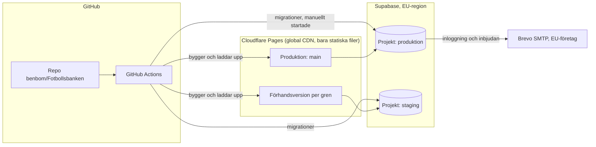

# 0002: Hosting, drift och kostnad

Status: föreslagen

## Kontext

ADR 0001 gör appen till en statisk SPA med Supabase som backend. Nu ska det bestämmas var appen och databasen körs, hur e-post skickas och hur CI och förhandsversioner fungerar. Följande krav gäller:

- **Drift på gratisnivåer.** Nya kostnader kräver användarens beslut (`CLAUDE.md`, `kravspec.md`).
- **Appen drivs av en ideell förening.** Vissa gratisnivåer gäller bara privat eller icke-kommersiellt bruk, och villkoren måste därför kontrolleras.
- **Personuppgifter ska lagras inom EU.** Det gäller i praktiken ledarnas konton: namn, e-post och medlemskap. Inga uppgifter om spelare lagras (`kravspec.md`).
- **E-post** behövs för inloggning och inbjudningar (berättelse 08 och 11, ADR 0004).
- **CI med GitHub Actions** och en förhandsversion per gren (uppdraget för fas 2). `main` ska alltid fungera (`CLAUDE.md`).
- **Förutsägbar användning.** Användningen är låg men säsongsbunden: en klubb först, ledare som planerar veckovis och uppehåll i vinter- och sommaruppehållen.
- **Repot `benbom/Fotbollsbanken` är privat** (kontrollerat med `gh repo view` 2026-09-11). Det påverkar vad GitHub ger gratis. Användaren beslutade 2026-09-12 att **repot görs publikt före fas 4**, se *Publikt repo och skydd av `main`* nedan.
- **Inga nya kostnader** (användarens beslut 2026-09-12). Ingen egen domän och ingen Supabase Pro. Besluten nedan ska rymmas i gratisnivåerna som de ser ut i dag, och de följder det får redovisas som kända risker i stället för att lösas med pengar.

### Villkor för gratisnivåerna

Uppgifterna hämtades 2026-09-11. Källorna står i slutet.

| Tjänst | Gratisnivå | Villkor för kommersiellt bruk | När gränsen nås |
|---|---|---|---|
| **Supabase Free** | 500 MB databas, 5 GB egress (plus 5 GB cachad), 50 000 aktiva användare per månad, 1 GB fillagring, 500 000 anrop till Edge Functions, högst 2 aktiva projekt. Inga automatiska säkerhetskopior. Branching ingår inte. | Prissidan nämner ingen begränsning till icke-kommersiellt bruk. Användarvillkoren har inte lästs i sin helhet. | Först ett meddelande och en frist. Den som fortsätter överskrida kan få projekten pausade, databasen skrivskyddad eller svar med HTTP 402 på alla API-anrop. Fristen ges bara en gång. |
| **Supabase, paus vid inaktivitet** | Ett gratisprojekt pausas efter en vecka utan tillräcklig databasaktivitet. Enligt dokumentationen räcker ”a few user requests to the database each day”. | – | Ett pausat projekt kan återställas från dashboarden i upp till ett år, med data och inställningar kvar. En äldre changelog anger 90 dagar, men den aktuella dokumentationssidan anger ett år. |
| **Supabase, inbyggd e-post** | Skickar bara till adresser i projektets team, högst 2 meddelanden per timme. Supabase avråder från den i produktion. | – | Meddelanden till andra adresser skickas inte. |
| **Supabase med egen SMTP** | Startar på 30 meddelanden per timme och kan höjas i inställningarna för gränser. | – | Meddelanden över gränsen avvisas. |
| **Cloudflare Pages Free** | 500 byggen per månad, 1 bygge åt gången, 20 000 filer och 25 MiB per fil, obegränsat antal förhandsversioner. Gränssidan anger ingen bandbreddsgräns för statiska filer. | Gränssidan nämner ingen begränsning till icke-kommersiellt bruk. | Byggen över kvoten körs inte. |
| **Vercel Hobby** | Generösa kvoter. | **”the Hobby plan restricts users to non-commercial, personal use only”** | Funktionen spärras i 30 dagar. |
| **Brevo Free** | 300 e-postmeddelanden per dag, SMTP och API ingår. | Ingen begränsning hittades. | Upp till 1 000 transaktionsmeddelanden läggs i en kö för nytt försök, och de som inte ryms i kön levereras inte. |
| **Resend Free** | 3 000 meddelanden per månad, högst 100 per dag, 3 domäner, loggar sparas i 30 dagar. | Nämns inte. | Anges inte. |
| **GitHub Actions (GitHub Free, privat repo)** | 2 000 minuter och 500 MB lagring för artefakter per månad. Publika repon är gratis. | – | Utan betalmetod blockeras körningar när kvoten är slut. |

## Beslut

### Driftöversikt

1. **Webbhotell: Cloudflare Pages Free** för det statiska bygget. Varje gren får en egen förhandsadress (`<gren>.<projekt>.pages.dev`). Produktionen körs från `main`. **Ingen egen domän köps** (användarens beslut 2026-09-12). Appen nås på `<projekt>.pages.dev`. Följden för e-postleveransen står under *Drift och risker*.

   **Säkerhetsheaders levereras med bygget** (S-17). En `_headers`-fil i bygget är gratis och sätts upp en gång, och den är det som återstår om en XSS ändå tar sig in via skissdata (S-07) eller ett komprometterat npm-paket. Utan den kan sådan kod anropa vilken domän som helst och skicka ledarens förnyelsetoken dit, och utan `frame-ancestors` kan appen ramas in för clickjacking mot till exempel ”Ta bort ledare ur laget”. Headern är också det verkliga skyddet för förnyelsetoken i localStorage (ADR 0004 och 0005).
   - `Content-Security-Policy` med `default-src 'self'`, `connect-src` begränsad till projektets Supabase-domän och Turnstile, `object-src 'none'`, `base-uri 'none'` och `frame-ancestors 'none'`
   - `Strict-Transport-Security`, `X-Content-Type-Options: nosniff` och `Referrer-Policy: no-referrer`. Den sista skyddar också inbjudningstoken från att läcka i `Referer`, se ADR 0004 (S-14)
   - CI underkänner bygget om headerfilen saknas i det som laddas upp. Byggs i inkrement 1.
2. **Databas, Auth och Edge Functions: Supabase Free** i en EU-region. Förstahandsval är `eu-north-1` (Stockholm), annars `eu-central-1` (Frankfurt). Tillgängliga regioner kontrolleras när projektet skapas. Två projekt, som ryms i gratisnivåns två aktiva projekt:
   - **produktion**, som bara `main` pekar på
   - **staging**, som alla förhandsversioner pekar på, med testdata och aldrig riktiga personuppgifter
   
   Utveckling och CI använder en lokal Supabase i Docker (`supabase start`), som inte kostar något och inte räknas mot kvoterna.
3. **E-post: Brevo Free som egen SMTP i Supabase Auth.** Brevo ger 300 meddelanden per dag, vilket är mer än Resends 100, och är ett franskt företag. Innan Brevo tas i drift ska det bekräftas i Brevos personuppgiftsbiträdesavtal var datan lagras. Säkerhetsagenten granskar det. Supabase Auths gräns sätts till en nivå under Brevos dagsgräns, se ADR 0004.
4. **CI: GitHub Actions** med följande jobb:
   - **Varje push till en gren:** `tsc --noEmit`, ESLint, Vitest, bygge, och uppladdning av en förhandsversion till Cloudflare med `wrangler pages deploy --branch=<gren>`. En Cloudflare-token med minsta möjliga behörighet (bara Pages) sparas som hemlighet i GitHub.
   - **Pull request mot `main` och ändringar under `supabase/`:** pgTAP-tester mot lokal Supabase i Docker.
   - **Pull request mot `main` och ändringar under `src/`:** Playwright med axe mot bygget.
   - **Merge till `main`:** allt ovan, uppladdning till produktion och migrationer till staging.
   - **Migrationer till produktion:** körs med ett manuellt startat arbetsflöde (`workflow_dispatch`) efter kontrollpunkten, aldrig automatiskt.
   - **Import av övningsbanken** (`importera-banken`, ADR 0010): körs vid push till `main` när `content/ovningar/**` har ändrats. Jobbet använder **importrollen `importer`, aldrig servicenyckeln** (S-05, ADR 0003). Rollens **anslutningssträng till Postgres** — inte en API-nyckel, se ADR 0003 om varför — ligger som miljöhemlighet i en **GitHub Environment med krav på godkännande**, inte som en vanlig repohemlighet, så att ett nyskrivet arbetsflöde inte kommer åt den utan att användaren släpper fram körningen.
   - **Rättigheter:** förvalt `GITHUB_TOKEN`-läge för repot är read-only, och varje arbetsflöde begär uttryckligen de rättigheter det behöver. Inget arbetsflöde utlöses av `pull_request_target`, och inga hemligheter ges till arbetsflöden som utlöses av pull requests från forkar (S-03, S-04).
   - `concurrency` med `cancel-in-progress` avbryter överflödiga körningar, och npm-cachen och Playwrights webbläsare cachas för att spara minuter.
   
   Uppladdningen sker från GitHub Actions i stället för med Cloudflares Git-integration. Då laddas bara det upp som har klarat testerna, och Cloudflare behöver ingen läsbehörighet till repot.
5. **Hålla databasen vaken (förslag, kräver beslut):** ett schemalagt arbetsflöde i GitHub Actions gör en lätt läsning mot produktionens databas en gång per dag, så att projektet inte pausas under uppehåll. Det kostar ungefär 30 Actions-minuter i månaden. Se *Beslut som behövs*.
6. **Säkerhetskopior: krypterade med publik nyckel** (S-09). Supabase Free har inga säkerhetskopior alls, så behovet är verkligt. Ett schemalagt arbetsflöde kör `supabase db dump` en gång i veckan, krypterar filen och sparar den som artefakt i Actions i **30 dagar**. Filen innehåller ledarnas personuppgifter och får aldrig sparas okrypterad.

   Krypteringen sker med **publik nyckel** (`age`), och det är själva poängen: **bara den publika nyckeln checkas in, och den privata nyckeln finns hos användaren, aldrig i GitHub.** CI kan då skapa en säkerhetskopia men aldrig läsa en. En symmetrisk nyckel som hemlighet i samma repo hade inte skyddat mot det troligaste hotet — en agent som får igenom en arbetsflödesfil och hämtar både dumpen och nyckeln — och när repot blir publikt är krypteringen dessutom det enda som skiljer artefakten från en publik nedladdning.

   **Återläsningen provas en gång** innan kedjan räknas som klar. En säkerhetskopia som aldrig har återlästs är en förhoppning, inte en kopia. Provet görs mot ett lokalt Supabase i Docker, inte mot produktionen, och dokumenteras i driftrutinen i fas 5.

   Artefakter hos GitHub ligger utanför EU. Det är en dokumenterad överföring med standardavtalsklausuler, och den är godtagbar just för att uppgifterna är krypterade med en nyckel GitHub inte har. Alternativet, en dump i Supabase Storage i EU, hade hållit allt inom EU men gett den som har servicenyckeln både databasen och kopian. Behandlingen ska stå i integritetspolicyn, och en raderad ledare finns kvar i kopior i upp till 30 dagar (ADR 0003, *Lagringstider*).
7. **Övervakning av kvoter:** den som äger Supabase- och Cloudflare-kontona läser de e-postmeddelanden som skickas när en kvot närmar sig. Någon betald övervakning används inte.

### Publikt repo och skydd av `main`

Användaren beslutade 2026-09-12 att **repot görs publikt före fas 4**. Det är inte bara en kostnadsfråga: grenskydd för `main` blir gratis, och därmed blir lager 1 i godkännandekedjan i ADR 0010 en teknisk spärr i stället för en överenskommelse (S-04). Utan den kunde vem som helst med skrivrättighet — varje agent som kör med användarens git inräknad — pusha en fil med `status: godkand` direkt till `main`, och nästa import lade in övningen i den gemensamma banken utan att någon människa hade läst den. Actions blir gratis på köpet, och Secret Scanning med Push Protection ingår.

Villkoren före publicering, med den status de har i dag:

| Villkor | Status 2026-09-12 |
|---|---|
| Historikskanning efter hemligheter, redovisad (S-22) | **Klar.** Huvudsessionen har sökt igenom historiken utan träffar. Repot innehöll ingen kod, vilket var skälet att göra det nu |
| `.gitignore` kompletterad innan någon kod skrivs (S-22) | **Klar.** Huvudsessionen har utökat filen |
| Grenskydd, `CODEOWNERS` och read-only som förval för `GITHUB_TOKEN`, aktiverat samtidigt | `CODEOWNERS` är tillagd av huvudsessionen. Grenskyddet och tokenläget sätts i samma steg som publiceringen |
| Inga arbetsflöden som utlöses av `pull_request_target`, inga hemligheter till arbetsflöden från forkar | Beslutat i punkt 4 ovan. Gäller från första arbetsflödet |
| Säkerhetskopior med publik nyckel innan repot blir publikt (S-09) | Beslutat i punkt 6. Måste vara på plats före publiceringen, eftersom artefakter annars blir världsläsbara |
| Regel och CI-kontroll för `granskning.av` och `kalla` (S-21) | Beslutat i ADR 0010 |
| S-01, S-02 och S-06 lösta och testade | Beslutade i ADR 0003. Att RLS-policyerna blir läsbara för utomstående sänker inte säkerheten om de är riktiga, men det höjer kravet på att de är det |

**Supabases publika nyckel är avsedd att ligga i klientbygget och är inte en hemlighet.** Den är redan läsbar för var och en som öppnar appen. Servicenyckeln är motsatsen och finns efter S-05 inte i CI över huvud taget (ADR 0003).

Publiceringen gör också övningsbanken fritt kopierbar. Det är en fråga om innehållslicens snarare än säkerhet, och den lämnas till användaren, se *Beslut som behövs* i rapporten.

## Alternativ

**Vercel Hobby.** Valdes bort eftersom villkoren uttryckligen begränsar gratisnivån till privat, icke-kommersiellt bruk. En app för en förening och flera klubbar är inte privat bruk, och Pro kostar 20 USD per användare och månad. Det skulle vara en ny kostnad.

**Netlify Free.** Stöder förhandsversioner per gren. Villkoren för gratisnivån har inte kontrollerats i detta uppdrag. Netlify kan väljas om Cloudflare av någon anledning inte fungerar, men då behöver villkoren kontrolleras först.

**GitHub Pages.** Ger ingen förhandsversion per gren. En SPA kräver dessutom en omväg via `404.html` för routingen, och för privata repon krävs en betald GitHub-plan.

**Supabase Branching** (en databas per gren). Ingår inte i gratisnivån, eftersom det kräver Pro och kostar 0,01344 USD per gren och timme. Ett gemensamt stagingprojekt och en lokal databas i CI ger nästan samma sak utan kostnad.

**Supabases inbyggda e-post.** Duger inte i produktion: den skickar bara till projektets team och högst 2 meddelanden per timme.

**Resend.** Är det vanligaste valet tillsammans med Supabase, och fungerar som reserv. Gratisnivån ger 100 meddelanden per dag, vilket är mindre än Brevos 300, och företaget är amerikanskt.

**En egen server eller VPS.** Kostar pengar och kräver underhåll. Valdes bort.

## Konsekvenser

**Kostnad**
- Enligt villkoren den 2026-09-11 kostar driften 0 kronor så länge kvoterna räcker. Ingen av tjänsterna tar betalt utan att någon aktivt uppgraderar, och när en gräns överskrids begränsas tjänsten i stället för att det kommer en faktura.
- Den verkliga risken är att tjänsten slutar fungera, inte att det kommer en kostnad: databasen blir skrivskyddad, API:et svarar med 402, e-post levereras inte eller CI blockeras. Det ska finnas en rutin för vad som görs när det händer, och den skrivs i fas 5.
- **Inga nya kostnader tas** (användarens beslut 2026-09-12). Tre poster som annars hade legat nära till hands är därmed avförda, med de följder som anges:
  - **egen domän** (ungefär 100–200 kronor per år): avförd. Följden är sämre leveranssäkerhet för inloggningsmejlen, se *Drift och risker* och ADR 0004
  - **GitHub Pro** för skyddade grenar i ett privat repo: behövs inte, eftersom repot görs publikt i stället
  - **Supabase Pro** (25 USD per månad): avförd. Följden är att tidsbegränsade sessioner och automatiska säkerhetskopior inte finns, vilket hanteras av beslut 6 och av den kända risken i ADR 0004 (S-11)

**Kvoter i förhållande till förväntad användning**
- Databasen (500 MB) räcker gott. Övningar, pass och säsongsplaner är små textposter, och planskisser lagras som skissdata, inte som bilder.
- 50 000 aktiva användare per månad och 5 GB egress ligger långt över vad en klubb använder. Övningsbanken cachas i klienten (ADR 0005), så den hämtas inte vid varje besök.
- **GitHub Actions är den kvot som tar slut först.** En fullständig körning med lint, typkontroll, enhetstester, pgTAP i Docker, Playwright och bygge beräknas ta 10–15 minuter. 2 000 minuter räcker då till ungefär 130–200 fullständiga körningar i månaden, och det kan bli trångt när agentlaget bygger intensivt. Därför är de tyngsta jobben begränsade till pull requests och relevanta sökvägar. Repot görs publikt före fas 4 (användarens beslut 2026-09-12), och då blir Actions gratis och kvoten upphör att vara den trånga sektorn.
- E-post: Brevo ger 300 meddelanden per dag. Det räcker för inbjudningar och inloggning i en klubb, men en stor inbjudan av många ledare samma dag kan slå i taket. Se ADR 0004.

**Drift och risker**
- **Pausning:** utan att databasen hålls vaken pausas produktionen efter en veckas uppehåll, och appen fungerar inte förrän någon trycker ”Resume project”. Stagingprojektet får pausas, eftersom det bara används under utveckling.
- **Säkerhetskopior** saknas helt på gratisnivån tills arbetsflödet i beslut 6 finns. Tills dess kan data som förloras inte återställas. Kopian räknas som klar först när en återläsning har provats en gång (S-09); fram till dess är den oprövad.
- **Staging delas av alla grenar.** Två grenar med olika migrationer kan krocka i stagingdatabasen. Det accepteras eftersom få grenar är aktiva samtidigt, och den lokala databasen i CI är den som avgör om testerna går igenom.
- **Förhandsversionerna ligger öppet på internet** på gissningsbara adresser, och en förhandsversion kan ha en halvfärdig RLS-policy (S-23). Skadan är begränsad så länge staging bara har testdata, och regeln **aldrig riktiga personuppgifter i staging** är därför en regel som ska testas, inte en ambition. Staging har egna nycklar, skilda från produktionens. Cloudflare Access framför förhandsversionerna är gratis upp till 50 användare och kan läggas till i fas 4 om det behövs.
- **Grenskydd för `main`** kräver enligt uppgift en betald GitHub-plan för privata repon. Det har inte verifierats i detta uppdrag, eftersom dokumentationssidan inte angav vilka planer som stöds, och frågan förlorar sin betydelse när repot görs publikt: då är grenskyddet gratis. Fram till publiceringen upprätthålls ”`main` ska alltid fungera” bara av arbetsflödet i `CLAUDE.md`, där bara huvudsessionen mergar, och inte tekniskt (S-04).
- **E-postleveransen är den tydligaste följden av att ingen egen domän köps** (användarens beslut 2026-09-12). SPF, DKIM och DMARC kan inte sättas upp för en egen avsändardomän, och inloggningsmejl från en avsändare utan autentiserad domän hamnar oftare i skräpposten. Eftersom inloggningen bygger på en engångskod per mejl (ADR 0004) betyder ett mejl i skräpposten att ledaren inte kommer in alls. Detta är en **känd och accepterad risk**. Planen är att **mäta i inkrement 3**: följ hur många inloggningar som misslyckas med att koden aldrig kom fram, och testa mot Gmail, Outlook och en telefonoperatörs adress. Fastnar mejlen i skräpposten lyfts domänfrågan till användaren igen, eftersom en domän då är den enda verkliga lösningen.
- **Brevos villkor är inte bekräftade.** Om Brevos gratisnivå tillåter en avsändare utan egen domän gick inte att kontrollera 2026-09-12: `help.brevo.com` svarade med HTTP 403 på båda försöken, och säkerhetsagenten fick 404 eller tomt innehåll på tre andra adresser. Frågan är öppen och avgör om beslut 3 håller, se *Beslut som behövs* i rapporten.
- **Cloudflare** levererar bara statiska filer utan personuppgifter. Cloudflare ser ändå besökarnas IP-adresser och är därför personuppgiftsbiträde, och lokaliserar inte till EU utan det betalda tillägget Data Localization Suite. Det hanteras med standardavtalsklausuler och ska erkännas i integritetspolicyn, inte antas bort. Säkerhetsagenten granskar det och Supabases underbiträdeslista inför K5.
- **Villkoren kan ändras.** De gäller den 2026-09-11 och ska kontrolleras igen före K5.

## Källor

Alla hämtade 2026-09-11.

- Supabase, prissida: <https://supabase.com/pricing>
- Supabase, Billing FAQ (kvoter och begränsningar): <https://supabase.com/docs/guides/platform/billing-faq>
- Supabase, Project Pausing: <https://supabase.com/docs/guides/platform/free-project-pausing>
- Supabase, changelog om återställning inom 90 dagar (äldre uppgift): <https://supabase.com/changelog/27497-paused-free-plan-projects-are-restorable-for-90-days>
- Supabase, egen SMTP: <https://supabase.com/docs/guides/auth/auth-smtp>
- Vercel, Hobby-planen (sidan senast uppdaterad 2026-08-31): <https://vercel.com/docs/plans/hobby>
- Cloudflare Pages, gränser: <https://developers.cloudflare.com/pages/platform/limits/>
- Resend, prissida: <https://resend.com/pricing>
- Brevo, gränser för gratisplanen, via sökresultat (prissidan kunde inte läsas maskinellt): <https://help.brevo.com/hc/en-us/articles/208580669-FAQs-What-are-the-limits-of-the-Free-plan>
- GitHub, fakturering för Actions: <https://docs.github.com/en/billing/concepts/product-billing/github-actions>
