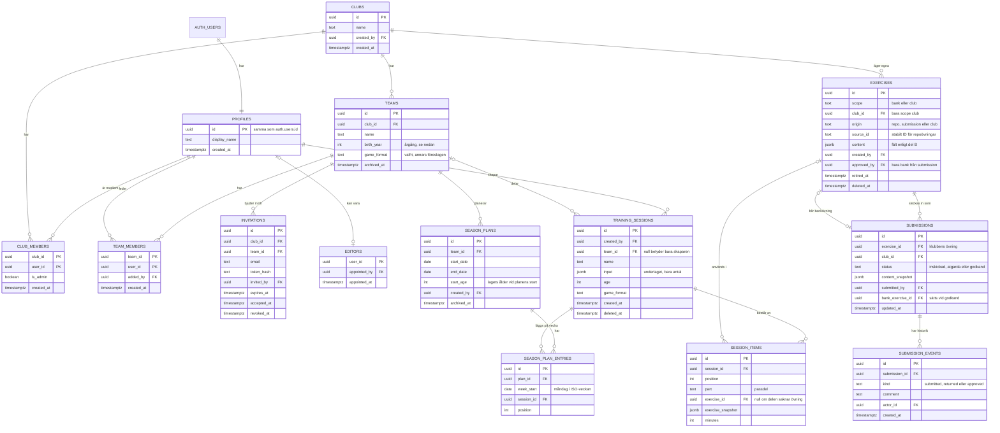
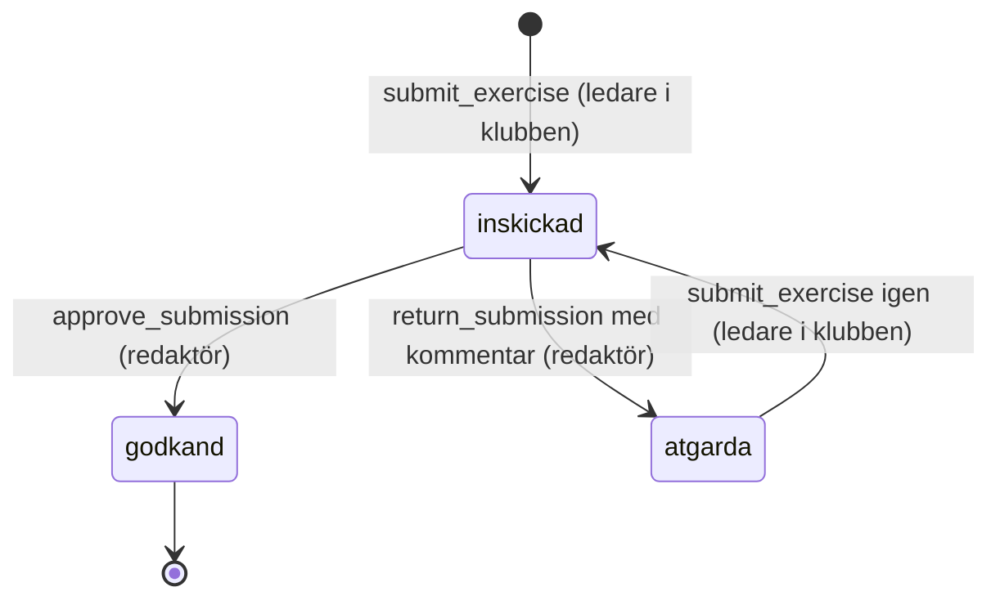

# 0003: Datamodell och isolering mellan klubbar

Status: beslutad (K2, 2026-09-12)

## Kontext

Datamodellen ska bära berättelserna i inkrement 3–7 och flödena i `docs/design/floden.md`. Följande krav styr den:

- **Flera klubbar från start.** En klubbs data får inte synas för en annan klubb (`kravspec.md`, berättelse 09, kriterium 3).
- **Inga uppgifter om spelare, bara antal.** Personuppgifter finns bara för ledarnas konton (`CLAUDE.md`, berättelse 08, kriterium 5).
- **Roller:** ledare, klubbadmin och redaktör, och en person kan ha flera roller (`kravspec.md`). Rollmodellen beslutas slutgiltigt vid K2 (`kravspec.md`, beslut vid K1).
  - **Ledare** får tillgång till de lag de har bjudits in till, men inte till klubbens övriga lag (11.2). Alla ledare i ett lag har samma rättigheter (11, *Utanför*). Alla ledare i klubben ser och redigerar klubbens egna övningar (14.1–14.2).
  - **Klubbadmin** skapar klubben, lag och inbjudningar (09–11).
  - **Redaktör** är en roll för hela appen, inte för en klubb. En redaktör kan utse och återkalla andra redaktörer (18).
- **Sparade pass** innehåller övningar, ordning, tider och underlaget (05.1). Ett pass utan lag syns bara för ledaren själv. Ett lagpass syns för lagets ledare och finns kvar när en ledare lämnar laget (12). Varje sparande skapar ett nytt pass (05, *Utanför*).
- **Klubbens egna övningar** kan sparas ofullständiga (13.2). När en övning tas bort ska pass där den redan används inte påverkas i onödan (14.3).
- **Inskickning och redaktörskö:** en inskickad övning får status `inskickad` i kön (15.1). Redaktören sätter `godkand` eller `atgarda` med kommentar (16). Ledaren skickar in igen, och övningen får då `inskickad` igen (17.2). Historiken med alla kommentarer ska finnas kvar (17.3). Samma övning kan inte ligga i kön två gånger (15.4). Ingen övning får `godkand` utan att en människa har godkänt den (16.4, `CLAUDE.md`).
- **Säsongsplan:** en plan per lag med start- och slutdatum, indelad i veckor (23). En vecka kan ha flera pass (24.1, R-110). Veckans ålder följer R-113, där veckan hör till det år där dess torsdag ligger (ISO 8601).
- Övningens innehållsfält, skissformatet och regelmotorns datastrukturer detaljeras i del B (ADR 0010 och framåt). Här beskrivs övningen bara som entitet.

## Beslut

### Principer

1. **Postgres i Supabase med åtkomstregler på radnivå (RLS) på alla tabeller** i schemat `public`. RLS är den enda behörighetsgränsen, eftersom klienten talar direkt med databasen (ADR 0001). En kontroll i CI underkänner bygget om
   - någon tabell i `public` saknar RLS,
   - någon vy i `public` saknar `security_invoker = true` (S-02). En vy körs annars med vyägarens rättigheter och utvärderar aldrig RLS på de underliggande tabellerna, vilket gör varje vy till en möjlig tvärklubbsläcka. **Alla vyer skapas därför med `with (security_invoker = true)`**, `club_exercises_v` i ADR 0010 inräknad,
   - `storage.buckets` innehåller någon rad. Version 1 laddar inte upp filer, och en bucket med öppen policy är en av de vanligaste läckorna i Supabase-projekt (S-24).
2. **Varje tabell med klubbdata har `club_id`** (eller når klubben i ett steg via `team_id`). Då blir isoleringsreglerna enkla, går att indexera och kan granskas tabell för tabell.
3. **Operationer som ändrar status eller roller går bara via Postgres-funktioner** (RPC) som kontrollerar behörigheten och gör hela ändringen i en transaktion. Klienten får aldrig uppdatera kolumner som `status`, `is_admin` eller redaktörstabellen direkt. Det gäller:
   - `create_club`
   - `accept_invitation`
   - `submit_exercise`
   - `approve_submission`
   - `return_submission`
   - `appoint_editor`
   - `revoke_editor`
   - `transfer_editor_ownership` (S-15, se *Konton och roller*)
   - `delete_my_account` (S-10, se *Radering av konto* nedan)
   - `import_bank_exercises(jsonb)`, som bara importrollen får anropa (S-05)

   **Varje funktion i `public` sätts upp likadant** (S-06). Postgres ger som förval `execute` till `public`, och PostgREST exponerar allt i schemat `public` som RPC för både `anon` och `authenticated`. Förvalet måste därför aktivt tas bort, funktion för funktion:
   - `revoke execute ... from public, anon`, följt av uttrycklig `grant execute ... to authenticated`
   - varje `security definer`-funktion avbryter direkt om `auth.uid()` är null, även de som redan har en egen behörighetskontroll
   - `set search_path = ''` och helt kvalificerade tabellnamn i varje funktion
   - ett pgTAP-test per funktion som visar att anonym åtkomst nekas

   Det gäller också funktioner utan egen behörighetskontroll, till exempel dubblettkontrollen av klubbnamn, som annars låter vem som helst räkna upp klubbnamn utan att vara inloggad.
4. **Ett sparat pass är ett självbärande dokument.** Varje övning i passet sparas som en ögonblicksbild av övningens innehåll, tillsammans med en referens till originalet. Då påverkas passet inte när en egen övning ändras eller tas bort (14.3). Planläget och utskriften kan dessutom visa passet utan fler hämtningar, vilket behövs för dåligt nät (ADR 0005).
5. **Primärnycklar är `uuid`** (`gen_random_uuid()`). Övningar ur repot har dessutom ett stabilt text-ID, `source_id`, vars format beslutas i del B. Tider lagras som `timestamptz` och datum som `date`. Veckor räknas enligt ISO 8601 i tidszonen Europe/Stockholm.
6. **Mjuk borttagning** (`deleted_at` eller `archived_at`) används för lag, övningar och pass, där kraven säger att det som redan används inte ska påverkas (10.3, 14.3).
7. **Migrationer** skrivs som SQL i `supabase/migrations/` och är det enda sättet att ändra strukturen. Databastyperna för TypeScript genereras med `supabase gen types`.
8. **Varje UPDATE-policy har både `using` och `with check`, och `with check` binder de kolumner som avgör vem som äger raden till oförändrade värden** (S-01). Att ge en roll `update` på en rad är annars i praktiken att ge den rätt att flytta raden dit den vill. Utan detta skulle en ledare kunna köra `update exercises set scope='bank'` från webbläsarens konsol och publicera ogranskat innehåll i den gemensamma banken, eller `set club_id=<annan klubb>` och plantera data i en främmande klubb. Skyddet läggs i tre lager, eftersom en policy är lätt att skriva fel:
   - `with check` på varje UPDATE-policy som kräver att `scope`, `club_id` och `origin` är oförändrade,
   - kolumnrättigheter: `revoke update (scope, club_id, origin, approved_by, source_id) on exercises from authenticated`,
   - en `check`-begränsning som kräver `origin = 'club'` när `scope = 'club'`.

   pgTAP-test visar att var och en av de fem kolumnerna nekas. Samma princip gäller varje annan tabell där en kolumn avgör synlighet eller ägarskap.
9. **Gränser för storlek och antal upprätthålls i databasen** (S-08). Innehåll från ledare är den enklaste vägen att slå i gratisnivåns 500 MB och därmed göra databasen skrivskyddad för alla klubbar, och samma data laddas dessutom ned till varje klubbmedlems IndexedDB (ADR 0005). Gränserna är därför en driftfråga, inte bara en fråga om snygga formulär:
   - `check` på textlängder: passnamn 100 tecken, redaktörens kommentar 2 000, `beskrivning` 5 000, lagnamn 100
   - `check` på `pg_column_size(content) < 100000`, och på `pg_column_size(content -> 'planskiss') < 8192` (ADR 0012)
   - tak per klubb och per användare: 1 000 övningar per klubb och 200 pass per ledare och dygn
   - `max_rows` i PostgREST, så att en enskild fråga inte kan hämta hela banken i ett svep

   Exakta värden får justeras i inkrement 3–4, men gränsen ska finnas från första migrationen. Att lägga till ett tak i efterhand kräver att befintliga rader först städas.
10. **Lagringstider är en del av datamodellen, inte en driftrutin** (S-19). Mjuk borttagning i punkt 6 gör annars personuppgifter i praktiken permanenta: en ledare tar bort en egen övning som råkar innehålla ett spelarnamn i fritexten, raden får `deleted_at` men ligger kvar för alltid med `created_by` intakt och följer med i varje säkerhetskopia. Ett `pg_cron`-jobb, som ingår i Supabase, rensar därför hårt enligt tabellen i *Lagringstider* nedan.

### Entiteter

#### Konton och roller

- **`auth.users`** ägs av Supabase Auth och innehåller e-post och inloggningsuppgifter. **`profiles`** innehåller bara visningsnamnet, som enligt `docs/design/skisser/14-inloggning.md` visas för andra ledare i samma lag. Inga andra personuppgifter lagras.
- **`club_members`** kopplar en person till en klubb. `is_admin` anger om personen är klubbadmin. Tabellen tillåter att en person tillhör flera klubbar. Det är Should i backloggen, men modellen klarar det från start, och gränssnittet i version 1 kan utgå från en klubb.
- **`team_members`** kopplar en ledare till ett lag. Den som är med i ett lag är också medlem i lagets klubb. Det upprätthålls av `accept_invitation` och av en begränsning i databasen. Den som tas bort ur ett lag förlorar lagets material (11.3), men är kvar som medlem i klubben så länge personen har andra lag eller är klubbadmin.
- **`editors`** innehåller redaktörerna och gäller hela appen, inte en klubb. Den första redaktören, användaren själv, läggs in med ett engångsskript när produktionen sätts upp, eftersom ingen i appen kan utse den första (18). `revoke_editor` hindrar att den sista redaktören tas bort, och `delete_my_account` avbryter av samma skäl om personen är den sista redaktören (se *Radering av konto*).
- **Den första redaktören är ägare och kan inte återkallas av någon annan** (S-15). Utan det kan en hjälpredaktör som utsetts inför säsongen anropa `revoke_editor` på den som utsåg hen och därefter ensam kontrollera hela den gemensamma banken, utan någon väg tillbaka i appen. Tabellen får därför kolumnen `is_owner boolean`, satt bara för den första raden, och `revoke_editor` avbryter om målraden har `is_owner` och anroparen inte är samma person. Varje `appoint_editor` och `revoke_editor` loggas i `editor_events` med `actor_id`, `subject_id` och tidpunkt.
- **Ägarskapet kan flyttas, men aldrig försvinna.** Eftersom `is_owner` inte kan sättas från appen skulle rollen vara borta för gott om ägarens konto raderades, och ingen skulle därefter kunna skyddas mot `revoke_editor`. `transfer_editor_ownership(new_owner)` kan därför bara anropas av ägaren själv, kräver att målet redan är redaktör och flyttar `is_owner` i en transaktion. Ägaren måste flytta ägarskapet innan kontot kan raderas. Flytten loggas i `editor_events`.
- **Uppslagningen av ett konto på e-postadress** (18.1–18.2) kräver en exakt och fullständig adress, aldrig en delsträng, och antalet uppslagningar begränsas per redaktör och dygn. Funktionen röjer med nödvändighet om en adress har ett konto, och det är hela dess syfte, men den ska inte gå att använda för att prova sig fram (S-15, jämför S-13).
- **Roller som går att kombinera:** ledare (rader i `team_members`), klubbadmin (`club_members.is_admin`) och redaktör (en rad i `editors`) är oberoende av varandra. En person kan ha alla tre.

#### Klubbar och lag

- **`clubs`:** klubbens namn. Kontrollen av dubbletter (09.2) görs av en funktion som bara svarar på om ett liknande namn redan finns, efter att namnet normaliserats (gemener och utan extra blanksteg). Den visar inga andra klubbars uppgifter. Namnet är inte unikt i databasen, eftersom två klubbar på olika orter kan heta likadant.
- **`teams`:** laget sparar **årgång** (`birth_year`) i stället för ålder. Gränssnittet frågar efter ålder enligt 10.1 och räknar om: årgång = innevarande år − ålder, vilket följer R-010. Då behöver ingen uppdatera lagets ålder vid varje årsskifte. Om det är acceptabelt för produktägaren och fotbollsexperten framgår av *Beslut som behövs* i rapporten. Laget arkiveras med `archived_at` (10.3), och antalet pass som är kopplade till laget visas i varningen före arkiveringen.
- **`invitations`:** en inbjudan gäller ett lag. Den innehåller den inbjudnas e-post och ett hashat engångstoken och har ett utgångsdatum. Flödet beskrivs i ADR 0004. E-postadressen tillhör en person som ännu inte har samtyckt till något, så den raderas när inbjudan har accepterats, gått ut eller återkallats, efter högst 30 dagar.

#### Övningar

Alla övningar i databasen ligger i **en tabell, `exercises`**. Kolumnen `scope` skiljer banken från klubbarnas egna övningar:

| `scope` | `origin` | Vad det är | Vem kan läsa | Vem kan ändra |
|---|---|---|---|---|
| `bank` | `repo` | Den gemensamma bankens övningar från `content/ovningar/`, som följer flödet `utkast → granskad → godkand` i git. **Bara filer där en människa har satt `godkand` importeras.** | Alla inloggade | Ingen i appen. Bara importen i CI, med servicenyckeln. |
| `bank` | `submission` | En klubbövning som redaktören har godkänt i appen (16.2). | Alla inloggade | Ingen i appen efter godkännandet |
| `club` | `club` | Klubbens egen övning (13–14). Får vara ofullständig (13.2). | Klubbens medlemmar | Klubbens medlemmar |

- **Innehållet** ligger i `content` (jsonb) och följer övningsschemat från del B. Del B avgör också vilka fält som får egna kolumner för filtrering och index, till exempel ålder, spelform, nivå och fokusområden, och om schemat kontrolleras i databasen, till exempel med tillägget `pg_jsonschema`.
- **Bankens statusflöde i git** (`utkast`, `granskad`, `atgarda`, `godkand`) finns kvar i filerna i `content/ovningar/`. Databasen innehåller bara bankövningar som är godkända och i bruk. Om en fil ändras från `godkand` till något annat får raden `retired_at`. Generatorn väljer den då inte längre, men sparade pass behåller sin ögonblicksbild.
- **Borttagning av en klubbövning** sätter `deleted_at` (14.3). Övningen försvinner då ur listan och ur valen vid byte av övning. Pass som använder den har kvar sin ögonblicksbild.

#### Redaktörskön

- **`submissions`** har en rad per klubbövning som har skickats in. Statusvärdena följer berättelse 15–17:

- När ledaren skickar in sparas en **ögonblicksbild**, `content_snapshot`, av övningen. Redaktören granskar alltså exakt det som skickades in, även om klubbens övning ändras under tiden (14.4 varnar för det).
- `submit_exercise` kontrollerar att alla obligatoriska fält finns (15.2) och att det inte redan finns en rad för övningen med status `inskickad` (15.4). Det senare upprätthålls också av ett unikt partiellt index.
- **`approve_submission`** kan bara anropas av en redaktör. Funktionen skapar en ny rad i `exercises` med `scope = bank` och `origin = submission` från ögonblicksbilden, och sätter `status = godkand` på inskickningen i samma transaktion. Det finns ingen annan väg till `godkand`: klienten saknar skrivrättighet till `status`, och ingen trigger eller schemalagd process sätter den (16.4).
- **`submission_events`** är historiken. Varje inskickning, återsändning med kommentar och godkännande blir en rad med tidpunkt och vem som gjorde det. Alla kommentarer syns därför, inte bara den senaste (17.3).
- **Meddelandet** till ledaren vid `atgarda` (16.3) visas som status i appen i version 1: i ledarens lista och på övningen (15.3, 17.1). Om det också ska skickas e-post framgår av *Beslut som behövs* i rapporten.
- Status `granskad` används inte i appen. Enligt beslut 11 vid K1 granskar redaktören ensam, med stegen inskickad och sedan godkänd eller åtgärda.

#### Sparade pass

- **`training_sessions`:**
  - `team_id = null` betyder att passet bara syns för den som skapade det (12.2).
  - Ett pass med `team_id` syns för alla ledare i laget och finns kvar när skaparen lämnar laget (12.1, 12.3).
  - `created_by` används för spårbarhet och sätts till `null` om kontot raderas.
  - `input` innehåller underlaget: ålder, spelform, nivå, antal spelare, antal ledare, passlängd, fokusområden och yta. **Spelare lagras bara som antal.**
  - `age` och `game_format` ligger också i egna kolumner, eftersom säsongsplanens varning (24.5, R-113) och listorna behöver dem utan att läsa jsonb.
- **`session_items`:** en rad per moment i passet, med ordning (`position`), passdel (`part`, där värdena kommer från `docs/doman/passuppbyggnad.md` och fastställs i del B), tid och en ögonblicksbild av övningen. En del som saknar övning (R-100) sparas som en rad utan övning, med delens måltid. Pauser och andra fasta inslag (R-031) och hur de lagras beslutas i del B.
- **Namnförslaget** (05.3) räknas fram i klienten när passet sparas och sparas som vanligt namn.

#### Säsongsplan

- **`season_plans`:**
  - Högst en aktiv plan per lag. Det upprätthålls av ett unikt partiellt index på `team_id` där `archived_at` är null (23.2). En gammal säsong arkiveras innan en ny plan skapas.
  - Planen är gemensam för lagets ledare (23.3).
  - `start_age` sparas när planen skapas, räknat från lagets årgång och det kalenderår planen börjar i (R-113, första punkten).
- **Veckorna lagras inte som egna rader.** De räknas fram ur `start_date` och `end_date` som ISO-veckor (23.1). Veckans ålder räknas fram enligt R-113 i regelmotorn i del B. En tom vecka är alltså en vecka utan rader i `season_plan_entries` (24.4).
- **`season_plan_entries`:**
  - kopplar ett pass till en vecka, identifierad med veckans måndag (`week_start`)
  - flera rader per vecka är tillåtna (24.1), och `position` avgör ordningen inom veckan
  - samma pass får ligga på flera veckor (R-111)
  - databasen kontrollerar att `week_start` är en måndag inom planens period och att passet tillhör planens lag
- **Veckans fokus** (R-110) och varningarna om ålder och nickning (24.5) räknas fram ur passens `input`, `age` och ögonblicksbilder. De lagras inte.

### Behörighet och isolering

Hjälpfunktioner i Postgres, markerade `stable` och `security definer`, med `search_path` låst och bara läsrättighet till medlemstabellerna:

- `is_club_member(club_id)`
- `is_club_admin(club_id)`
- `is_team_member(team_id)`
- `is_editor()`

Alla bygger på `auth.uid()`.

| Tabell | Läsa | Skapa | Ändra | Ta bort |
|---|---|---|---|---|
| `profiles` | Sin egen rad, och visningsnamn för personer i samma lag. Klubbadmin ser hela klubbens ledare. | Skapas vid registrering (ADR 0004) | Sin egen rad | Via `delete_my_account` |
| `clubs` | Medlemmar | Bara via `create_club`, som också gör skaparen till klubbadmin | Klubbadmin | – (inte i version 1) |
| `club_members` | Klubbadmin ser alla i klubben. En ledare ser sig själv och de som finns i samma lag. | Via `create_club` och `accept_invitation` | Klubbadmin (`is_admin`) | Klubbadmin |
| `teams` | Lagets ledare och klubbadmin | Klubbadmin | Klubbadmin | Arkivering av klubbadmin |
| `team_members` | Lagets ledare och klubbadmin | Via `accept_invitation` | – | Klubbadmin |
| `invitations` | Klubbadmin i klubben | Klubbadmin (ADR 0004) | Återkallas av klubbadmin | Rensas automatiskt |
| `editors` | Redaktörer. Varje person kan se om hen själv är redaktör. | Via `appoint_editor`, bara av redaktör | – | Via `revoke_editor`, bara av redaktör |
| `exercises` med `scope = bank` | Alla inloggade (det finns ingen publik åtkomst, se Won't i `backlog.md`) | `import_bank_exercises` via importrollen, eller `approve_submission` | Samma | – (`retired_at` sätts av importen) |
| `exercises` med `scope = club` | Klubbens medlemmar | Klubbens medlemmar | Klubbens medlemmar | Klubbens medlemmar (mjukt) |
| `submissions`, `submission_events` | Klubbens medlemmar och redaktörer | Via `submit_exercise` | Via `approve_submission` och `return_submission` | – |
| `training_sessions`, `session_items` | Skaparen om `team_id` är null, annars lagets ledare | Skaparen. Med `team_id` krävs att skaparen är med i laget. | Samma som läsa | Samma som läsa (mjukt) |
| `season_plans`, `season_plan_entries` | Lagets ledare | Lagets ledare | Lagets ledare | Lagets ledare |

Två saker i tabellen är förslag som kräver beslut vid K2 och beskrivs under *Beslut som behövs* i rapporten:

- **Klubbadmin har ingen automatisk åtkomst till lagens pass och säsongsplaner.** Klubbadmin ser lagen, ledarna och antalet pass, men läser inte innehållet om hen inte själv är med i laget. Det följer principen om minsta behörighet och 11.2.
- **En redaktör kan söka upp ett konto på e-postadress** för att utse en ny redaktör (18.1–18.2), via en funktion som bara redaktörer kan anropa och som bara svarar med id och visningsnamn.

**Vem som ser vilka personer är fastställt** (S-16). ADR:n sa tidigare på ett ställe att `profiles` fick läsas för dem man delar lag **eller klubb** med, och på ett annat att `club_members` bara fick läsas för sig själv och de som finns i samma lag. Raderna motsade varandra, och det fanns därför ingen enskild sanning att skriva policyerna eller pgTAP-testerna mot. Den som skrev dem hade lika gärna kunnat välja den bredare tolkningen, och då hade varje ledare i en stor klubb kunnat lista namnen på klubbens samtliga ledare — ingen tvärklubbsläcka, men mer än vad 11.2 utlovar. **Den snävare tolkningen gäller: samma lag, plus klubbadmin som ser hela klubben.** Tabellen ovan är rättad efter den, och båda raderna säger nu samma sak.

**Servicenyckeln finns inte i CI** (S-05). En nyckel med `bypassrls` läser och skriver allt, `auth.users` inräknat, så sprängradien vid en läcka är total: ett arbetsflöde som skriver ut hemligheten i en logg ger både samtliga ledares e-postadresser och möjligheten att skriva vad som helst i banken. Importen behöver inte den behörigheten, och får den därför inte.

I stället skapas en egen databasroll, **`importer`**, med `noinherit` och **utan `bypassrls`**. Rollen har inga rättigheter på tabellerna alls, bara `execute` på `import_bank_exercises(jsonb)`, som är `security definer` och bara kan
- skriva rader med `scope = 'bank'` och `origin = 'repo'`, aldrig `origin = 'submission'` och aldrig `approved_by`,
- sätta och nollställa `retired_at` på sådana rader.

**Rollen nås med en Postgres-anslutningssträng, inte med en API-nyckel.** Det är värt att vara tydlig med, eftersom Supabases API-nycklar bara kan avbilda tre roller — `anon`, `authenticated` och `service_role` — och en egen roll som `importer` alltså inte går att nå den vägen. Den andra tänkbara vägen, en JWT med `role: importer` signerad med projektets JWT-hemlighet, är utesluten: den hemligheten kan signera en token för vilken roll som helst, `service_role` inräknad, och att lägga den i CI vore lika farligt som servicenyckeln och skulle göra hela den här ändringen meningslös. Importen ansluter därför direkt till Postgres som `importer` via session-poolern.

Anslutningssträngen lagras som miljöhemlighet knuten till en GitHub Environment med krav på godkännande, inte som en vanlig repohemlighet (ADR 0002, ADR 0010).

**Servicenyckeln** (`service_role`) används därefter bara i Edge Functions som skickar inbjudningar (ADR 0004), och i användarens egna manuella ingrepp i Supabase dashboard. Den finns aldrig i CI, aldrig i klienten och aldrig i det statiska bygget.

**Tester:** varje regel i tabellen ovan får pgTAP-tester med minst två klubbar, två lag i samma klubb och personer i varje roll och kombination av roller. Testerna visar både att det tillåtna fungerar och att det otillåtna nekas. Testerna ägs av kvalitetssäkraren.

### Radering av konto

Rätten till radering enligt artikel 17 är ovillkorlig och ska verkställas inom en månad. Den påverkar nycklar, `on delete`-beteende och om `created_by` får vara null, och kan därför inte skjutas till fas 5 (S-10). **Funktionen ingår i version 1** enligt användarens beslut 2026-09-12. Produktägaren skriver berättelsen parallellt.

`delete_my_account()` raderar den inloggades eget konto, aldrig någon annans, och gör allt i en transaktion:

| Steg | Vad som händer |
|---|---|
| Raderas | Raden i `profiles`, alla rader i `club_members` och `team_members`, inbjudningar som personen har skickat och som ännu inte accepterats, och pass med `team_id is null` med sina `session_items` |
| Avidentifieras | `created_by`, `submitted_by`, `actor_id` och `added_by` sätts till null på delat material: lagpass, klubbövningar, godkända bankövningar, inskickningar och deras historik |
| Behålls | Delat material i sig. Ett lagpass som raderas när dess skapare slutar skulle ta med sig andra ledares arbete, och en godkänd bankövning är granskat innehåll som klubbarna använder |
| Sist | Raden i `auth.users` raderas. Den ligger i ett schema som appen inte kommer åt, så det steget görs av en Edge Function som anropar funktionen ovan och därefter admin-API:et |

**Den sista klubbadminen blockeras.** Att låta en klubb bli kvar utan admin gör lag, inbjudningar och medlemskap omöjliga att förvalta, och det finns ingen väg i appen att utse en ny. Funktionen avbryter därför med ett tydligt fel om personen är ensam klubbadmin i någon klubb som har kvar andra medlemmar, och ledaren får först utse en till admin. Är personen ensam **medlem** i klubben raderas klubben med sina lag och övningar i samma transaktion, eftersom ingen då blir av med något.

**Den sista redaktören blockeras på samma sätt** (S-15, användarens beslut 2026-09-12). Redaktörsrollen gäller hela appen, och `appoint_editor` kräver att anroparen redan är redaktör. Raderar den sista redaktören sitt konto finns det därför ingen väg tillbaka i appen: inskickningar i kön kan varken godkännas eller återsändas, och en första redaktör måste sättas in på nytt med ett engångsskript mot databasen. `delete_my_account` avbryter alltså med ett tydligt fel om personen är den enda raden i `editors`, och redaktören får först utse en efterträdare. Är personen dessutom ägare (`is_owner`) krävs också att ägarskapet har flyttats med `transfer_editor_ownership`, eftersom `is_owner` inte kan sättas från appen. Till skillnad från klubbfallet finns ingen motsvarighet till ”ensam medlem”: den gemensamma banken tillhör inte redaktören och följer aldrig med i en radering.

Detta är den enda vägen. En radering för hand i Supabase dashboard missar `team_members` och de personliga passen, och går inte att visa att den verkställts.

**Export av egna uppgifter ingår inte i version 1.** Dataportabilitet enligt artikel 20 ligger i backloggen som Could (användarens beslut 2026-09-12). Modellen ska ändå inte stänga dörren för den. Allt som utgör en enskild persons eget material går att nå ur `auth.uid()` i ett steg: `profiles`, `club_members`, `team_members`, pass med `created_by`, klubbövningar, inskickningar och `submission_events` med `actor_id`. Det är samma urval som `delete_my_account` går igenom, så en senare `export_my_data()` blir en läsning av samma rader serialiserad till JSON, utan ändring i strukturen. Ögonblicksbilderna i passen gör dessutom en export läsbar i sig, utan att banken behöver följa med.

### Lagringstider

Bara inbjudningar hade en lagringstid. Resten fastställs här (S-19, användarens beslut om lagringstider). Ett `pg_cron`-jobb kör rensningen dagligen och loggar antalet rader.

| Vad | Tid | Vad som händer |
|---|---|---|
| Mjukt borttagna rader (`deleted_at`) | 90 dagar | Raderas hårt, med sina underrader |
| Arkiverade lag och säsongsplaner (`archived_at`) | 24 månader | Raderas hårt |
| Konton utan inloggning | 24 månader | Påminnelse per e-post, därefter radering med samma väg som `delete_my_account` |
| Inbjudningar | 30 dagar efter accept, utgång eller återkallande | E-postadressen tas bort (oförändrat, ADR 0004) |
| Säkerhetskopior | 30 dagar | Raderas av GitHub (ADR 0002) |

En raderad ledare finns kvar i säkerhetskopior i upp till 30 dagar. Det är godtagbart, men ska stå i integritetspolicyn (fas 5).

## Alternativ

**Ett schema eller en databas per klubb.** Ger stark isolering, men gör den gemensamma banken, redaktörskön och personer i flera klubbar krångliga. Gratisnivån har dessutom bara två projekt. Valdes bort till förmån för RLS med `club_id`.

**Behörighet i en egen serverdel i stället för RLS.** Kräver en server, se ADR 0001. Valdes bort.

**Bankövningar som statisk JSON i bygget i stället för i databasen.** Hade varit bra för dåligt nät. Valdes bort eftersom filerna på CDN:et då blir publikt nedladdningsbara, och publik åtkomst till banken är Won't. Generatorn skulle också få två källor, repot och de godkända inskickningarna. Banken cachas i stället i klienten efter inloggning (ADR 0005).

**Att låta klubbövningen själv byta `scope` till `bank` vid godkännande.** Valdes bort. Klubben skulle då förlora sin redigerbara övning, och en senare ändring i klubben skulle ändra bankens innehåll utan ny granskning. Med en kopia är bankens innehåll låst efter godkännandet.

**En enda statuskolumn på klubbövningen**, där `utkast` betyder både ”ofullständig egen övning” (13.1) och ”väntar i kön” (15.1). Valdes bort. De två betydelserna går inte att skilja åt, historiken i 17.3 kräver ändå en egen tabell, och dubblettkontrollen i 15.4 blir svår. Se den dokumentkonflikt som nämns under *Konsekvenser*.

**Pass som referenser utan ögonblicksbild.** Då skulle ett pass ändras när en övning redigeras eller tas bort, vilket strider mot 14.3. Planläget skulle också behöva hämta varje övning för sig. Valdes bort.

**Veckor som egna rader.** Behövs inte i version 1, eftersom det inte finns data per vecka utöver passen. Det blir aktuellt om perioder och teman (Could) tas in. Valdes bort tills vidare.

**Lagets ålder i stället för årgång.** Blir fel efter varje årsskifte om ingen uppdaterar den. Valdes bort, men kräver bekräftelse, se *Beslut som behövs*.

## Konsekvenser

**Fördelar**
- Isoleringen mellan klubbar upprätthålls på ett ställe, i databasen, och kan testas automatiskt tabell för tabell.
- Den gemensamma banken är låst för klienten. Den enda vägen till `godkand` i appen är en funktion som bara en redaktör kan anropa. I repot sätts `godkand` bara av en människa i git.
- Sparade pass fungerar som självbärande dokument i planläget, i utskriften och när nätet är dåligt.

**Nackdelar och risker**
- **RLS-regler är lätta att göra fel.** En glömd regel kan läcka data mellan klubbar. Det motverkas med kontrollen i CI att RLS är påslagen, pgTAP-tester för varje regel och granskning av säkerhetsagenten. `security definer`-funktionerna är de mest känsliga delarna.
- **Ögonblicksbilder dubblerar data.** Ett pass tar några kilobyte per övning. Det ryms utan problem i 500 MB, men en rättelse i en bankövning når inte redan sparade pass. Det stämmer med R-102 (ett pass som redan finns genereras inte om), men gränssnittet behöver kanske visa att en nyare version av övningen finns. Frågan lämnas till UX-designern.
- **Importen från repot går via importrollen**, inte servicenyckeln, och är därmed begränsad till `origin = 'repo'`. Den får bara läsa filer med `godkand` och ändrar aldrig status själv. En agent kan tekniskt ändra en fil till `godkand` i git. Skyddet mot det är grenskydd med `CODEOWNERS`, granskning av diffen före merge och CI-kontrollen i ADR 0010 avsnitt 3.
- **Personuppgifter:**
  - e-post i `auth.users` och `invitations`
  - namn i `profiles`
  - `created_by`, `submitted_by` och `actor_id` i flera tabeller
  - fritext som **lagnamn**, passnamn, övningstexter och redaktörens kommentarer, där en ledare kan skriva in ett spelarnamn trots att appen inte ber om det. Detta går inte att hindra tekniskt.
  
  **Lagnamnet är den mest sannolika bäraren av ett barns namn** (S-20). Ett lag som heter ”P2015 Kalles grupp” är precis det scenario uppdraget varnar för, och namnet visas för hela klubben och följer med i varje pass. Eftersom inga spelaruppgifter behandlas finns annars inga barns personuppgifter i systemet, och därmed ingen fråga om åldersgräns eller vårdnadshavares samtycke. Hela det skyddet vilar på att fritextfälten hålls rena, vilket gör detta viktigare än allvarlighetsgraden antyder. Det behandlas därför som ett krav på gränssnittet, inte som en restrisk: en kort hjälptext ”Skriv inga namn på spelare” vid lagnamn, passnamn, egna övningars fritextfält och redaktörskommentar, samma mening i integritetspolicyn och i texten klubbadmin ser när en klubb skapas. `texter.md` har en början, men bara vid registreringen. Texterna ägs av UX-designern och behöver beställas.
  
  När ett konto raderas tas profilen, medlemskapen och de personliga passen bort, medan lagpass och klubbövningar finns kvar med `created_by = null`. Vägen är `delete_my_account`, se *Radering av konto* ovan. Funktionen ingår i version 1 och byggs i inkrement 3.
- **Rättslig grund och ansvar** (användarens beslut 2026-09-12): **avtal** är rättslig grund för ledarnas konton, inte samtycke. En ledare som måste använda appen för att kunna leda sitt lag samtycker inte frivilligt, och ett återkallat samtycke skulle tvinga fram radering mitt i säsongen. **Föreningen är ensam personuppgiftsansvarig**, och anslutna klubbar är organisatoriska enheter i tjänsten, inte egna ansvariga. Alternativet, gemensamt ansvar, hade krävt ett avtal per klubb enligt artikel 26. Detta ska stå i integritetspolicyn, som skrivs före K5.
- **Begreppen `utkast` och `inskickad` hålls isär** (beslut vid K2, ADR 0010 avsnitt 4): `utkast` används bara om filer i `content/ovningar/`, som följer flödet `utkast → granskad → godkand` i git. En inskickad övning i appens redaktörskö har status `inskickad`, och en ofullständig egen övning i en klubb har ingen granskningsstatus alls, bara en härledd markering för om den är komplett. Kraven och designen är rättade efter samma beslut.
