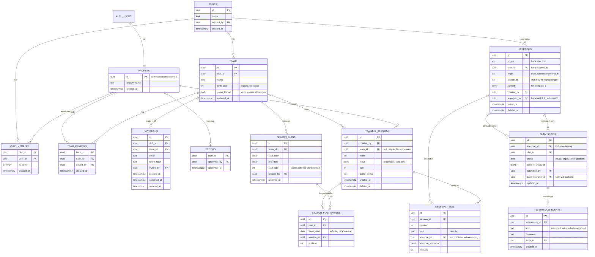
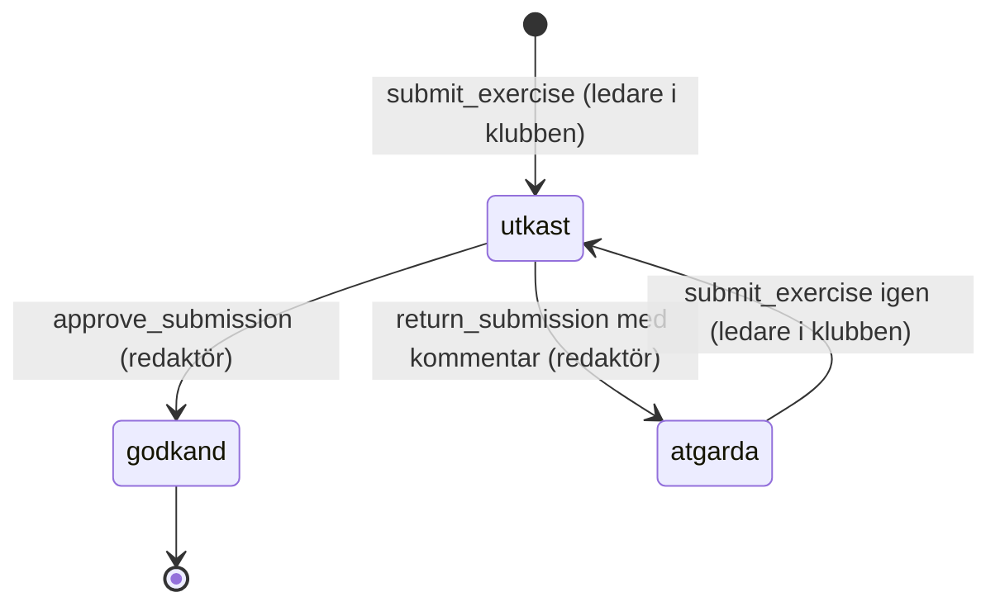

# 0003: Datamodell och isolering mellan klubbar

Status: föreslagen

## Kontext

Datamodellen ska bära berättelserna i inkrement 3–7 och flödena i `docs/design/floden.md`. Följande krav styr den:

- **Flera klubbar från start.** En klubbs data får inte synas för en annan klubb (`kravspec.md`, berättelse 09, kriterium 3).
- **Inga uppgifter om spelare, bara antal.** Personuppgifter finns bara för ledarnas konton (`CLAUDE.md`, berättelse 08, kriterium 5).
- **Roller:** ledare, klubbadmin och redaktör, och en person kan ha flera roller (`kravspec.md`). Rollmodellen beslutas slutgiltigt vid K2 (`kravspec.md`, beslut vid K1).
  - **Ledare** får tillgång till de lag de har bjudits in till, men inte till klubbens övriga lag (11.2). Alla ledare i ett lag har samma rättigheter (11, *Utanför*). Alla ledare i klubben ser och redigerar klubbens egna övningar (14.1–14.2).
  - **Klubbadmin** skapar klubben, lag och inbjudningar (09–11).
  - **Redaktör** är en roll för hela appen, inte för en klubb. En redaktör kan utse och återkalla andra redaktörer (18).
- **Sparade pass** innehåller övningar, ordning, tider och underlaget (05.1). Ett pass utan lag syns bara för ledaren själv. Ett lagpass syns för lagets ledare och finns kvar när en ledare lämnar laget (12). Varje sparande skapar ett nytt pass (05, *Utanför*).
- **Klubbens egna övningar** kan sparas ofullständiga (13.2). När en övning tas bort ska pass där den redan används inte påverkas i onödan (14.3).
- **Inskickning och redaktörskö:** en inskickad övning får status `utkast` i kön (15.1). Redaktören sätter `godkand` eller `atgarda` med kommentar (16). Ledaren skickar in igen, och övningen får då `utkast` igen (17.2). Historiken med alla kommentarer ska finnas kvar (17.3). Samma övning kan inte ligga i kön två gånger (15.4). Ingen övning får `godkand` utan att en människa har godkänt den (16.4, `CLAUDE.md`).
- **Säsongsplan:** en plan per lag med start- och slutdatum, indelad i veckor (23). En vecka kan ha flera pass (24.1, R-110). Veckans ålder följer R-113, där veckan hör till det år där dess torsdag ligger (ISO 8601).
- Övningens innehållsfält, skissformatet och regelmotorns datastrukturer detaljeras i del B (ADR 0010 och framåt). Här beskrivs övningen bara som entitet.

## Beslut

### Principer

1. **Postgres i Supabase med åtkomstregler på radnivå (RLS) på alla tabeller** i schemat `public`. RLS är den enda behörighetsgränsen, eftersom klienten talar direkt med databasen (ADR 0001). En kontroll i CI underkänner bygget om någon tabell saknar RLS.
2. **Varje tabell med klubbdata har `club_id`** (eller når klubben i ett steg via `team_id`). Då blir isoleringsreglerna enkla, går att indexera och kan granskas tabell för tabell.
3. **Operationer som ändrar status eller roller går bara via Postgres-funktioner** (RPC) som kontrollerar behörigheten och gör hela ändringen i en transaktion. Klienten får aldrig uppdatera kolumner som `status`, `is_admin` eller redaktörstabellen direkt. Det gäller:
   - `create_club`
   - `accept_invitation`
   - `submit_exercise`
   - `approve_submission`
   - `return_submission`
   - `appoint_editor`
   - `revoke_editor`
4. **Ett sparat pass är ett självbärande dokument.** Varje övning i passet sparas som en ögonblicksbild av övningens innehåll, tillsammans med en referens till originalet. Då påverkas passet inte när en egen övning ändras eller tas bort (14.3). Planläget och utskriften kan dessutom visa passet utan fler hämtningar, vilket behövs för dåligt nät (ADR 0005).
5. **Primärnycklar är `uuid`** (`gen_random_uuid()`). Övningar ur repot har dessutom ett stabilt text-ID, `source_id`, vars format beslutas i del B. Tider lagras som `timestamptz` och datum som `date`. Veckor räknas enligt ISO 8601 i tidszonen Europe/Stockholm.
6. **Mjuk borttagning** (`deleted_at` eller `archived_at`) används för lag, övningar och pass, där kraven säger att det som redan används inte ska påverkas (10.3, 14.3).
7. **Migrationer** skrivs som SQL i `supabase/migrations/` och är det enda sättet att ändra strukturen. Databastyperna för TypeScript genereras med `supabase gen types`.

### Entiteter

#### Konton och roller

- **`auth.users`** ägs av Supabase Auth och innehåller e-post och inloggningsuppgifter. **`profiles`** innehåller bara visningsnamnet, som enligt `docs/design/skisser/14-inloggning.md` visas för andra ledare i samma lag. Inga andra personuppgifter lagras.
- **`club_members`** kopplar en person till en klubb. `is_admin` anger om personen är klubbadmin. Tabellen tillåter att en person tillhör flera klubbar. Det är Should i backloggen, men modellen klarar det från start, och gränssnittet i version 1 kan utgå från en klubb.
- **`team_members`** kopplar en ledare till ett lag. Den som är med i ett lag är också medlem i lagets klubb. Det upprätthålls av `accept_invitation` och av en begränsning i databasen. Den som tas bort ur ett lag förlorar lagets material (11.3), men är kvar som medlem i klubben så länge personen har andra lag eller är klubbadmin.
- **`editors`** innehåller redaktörerna och gäller hela appen, inte en klubb. Den första redaktören, användaren själv, läggs in med ett engångsskript när produktionen sätts upp, eftersom ingen i appen kan utse den första (18). `revoke_editor` hindrar att den sista redaktören tas bort.
- **Roller som går att kombinera:** ledare (rader i `team_members`), klubbadmin (`club_members.is_admin`) och redaktör (en rad i `editors`) är oberoende av varandra. En person kan ha alla tre.

#### Klubbar och lag

- **`clubs`:** klubbens namn. Kontrollen av dubbletter (09.2) görs av en funktion som bara svarar på om ett liknande namn redan finns, efter att namnet normaliserats (gemener och utan extra blanksteg). Den visar inga andra klubbars uppgifter. Namnet är inte unikt i databasen, eftersom två klubbar på olika orter kan heta likadant.
- **`teams`:** laget sparar **årgång** (`birth_year`) i stället för ålder. Gränssnittet frågar efter ålder enligt 10.1 och räknar om: årgång = innevarande år − ålder, vilket följer R-010. Då behöver ingen uppdatera lagets ålder vid varje årsskifte. Om det är acceptabelt för produktägaren och fotbollsexperten framgår av *Beslut som behövs* i rapporten. Laget arkiveras med `archived_at` (10.3), och antalet pass som är kopplade till laget visas i varningen före arkiveringen.
- **`invitations`:** en inbjudan gäller ett lag. Den innehåller den inbjudnas e-post och ett hashat engångstoken och har ett utgångsdatum. Flödet beskrivs i ADR 0004. E-postadressen tillhör en person som ännu inte har samtyckt till något, så den raderas när inbjudan har accepterats, gått ut eller återkallats, efter högst 30 dagar.

#### Övningar

Alla övningar i databasen ligger i **en tabell, `exercises`**. Kolumnen `scope` skiljer banken från klubbarnas egna övningar:

| `scope` | `origin` | Vad det är | Vem kan läsa | Vem kan ändra |
|---|---|---|---|---|
| `bank` | `repo` | Den gemensamma bankens övningar från `content/ovningar/`, som följer flödet `utkast → granskad → godkand` i git. **Bara filer där en människa har satt `godkand` importeras.** | Alla inloggade | Ingen i appen. Bara importen i CI, med servicenyckeln. |
| `bank` | `submission` | En klubbövning som redaktören har godkänt i appen (16.2). | Alla inloggade | Ingen i appen efter godkännandet |
| `club` | `club` | Klubbens egen övning (13–14). Får vara ofullständig (13.2). | Klubbens medlemmar | Klubbens medlemmar |

- **Innehållet** ligger i `content` (jsonb) och följer övningsschemat från del B. Del B avgör också vilka fält som får egna kolumner för filtrering och index, till exempel ålder, spelform, nivå och fokusområden, och om schemat kontrolleras i databasen, till exempel med tillägget `pg_jsonschema`.
- **Bankens statusflöde i git** (`utkast`, `granskad`, `atgarda`, `godkand`) finns kvar i filerna i `content/ovningar/`. Databasen innehåller bara bankövningar som är godkända och i bruk. Om en fil ändras från `godkand` till något annat får raden `retired_at`. Generatorn väljer den då inte längre, men sparade pass behåller sin ögonblicksbild.
- **Borttagning av en klubbövning** sätter `deleted_at` (14.3). Övningen försvinner då ur listan och ur valen vid byte av övning. Pass som använder den har kvar sin ögonblicksbild.

#### Redaktörskön

- **`submissions`** har en rad per klubbövning som har skickats in. Statusvärdena följer berättelse 15–17:

- När ledaren skickar in sparas en **ögonblicksbild**, `content_snapshot`, av övningen. Redaktören granskar alltså exakt det som skickades in, även om klubbens övning ändras under tiden (14.4 varnar för det).
- `submit_exercise` kontrollerar att alla obligatoriska fält finns (15.2) och att det inte redan finns en rad för övningen med status `utkast` (15.4). Det senare upprätthålls också av ett unikt partiellt index.
- **`approve_submission`** kan bara anropas av en redaktör. Funktionen skapar en ny rad i `exercises` med `scope = bank` och `origin = submission` från ögonblicksbilden, och sätter `status = godkand` på inskickningen i samma transaktion. Det finns ingen annan väg till `godkand`: klienten saknar skrivrättighet till `status`, och ingen trigger eller schemalagd process sätter den (16.4).
- **`submission_events`** är historiken. Varje inskickning, återsändning med kommentar och godkännande blir en rad med tidpunkt och vem som gjorde det. Alla kommentarer syns därför, inte bara den senaste (17.3).
- **Meddelandet** till ledaren vid `atgarda` (16.3) visas som status i appen i version 1: i ledarens lista och på övningen (15.3, 17.1). Om det också ska skickas e-post framgår av *Beslut som behövs* i rapporten.
- Status `granskad` används inte i appen. Enligt beslut 11 vid K1 granskar redaktören ensam, med stegen inskickad och sedan godkänd eller åtgärda.

#### Sparade pass

- **`training_sessions`:**
  - `team_id = null` betyder att passet bara syns för den som skapade det (12.2).
  - Ett pass med `team_id` syns för alla ledare i laget och finns kvar när skaparen lämnar laget (12.1, 12.3).
  - `created_by` används för spårbarhet och sätts till `null` om kontot raderas.
  - `input` innehåller underlaget: ålder, spelform, nivå, antal spelare, antal ledare, passlängd, fokusområden och yta. **Spelare lagras bara som antal.**
  - `age` och `game_format` ligger också i egna kolumner, eftersom säsongsplanens varning (24.5, R-113) och listorna behöver dem utan att läsa jsonb.
- **`session_items`:** en rad per moment i passet, med ordning (`position`), passdel (`part`, där värdena kommer från `docs/doman/passuppbyggnad.md` och fastställs i del B), tid och en ögonblicksbild av övningen. En del som saknar övning (R-100) sparas som en rad utan övning, med delens måltid. Pauser och andra fasta inslag (R-031) och hur de lagras beslutas i del B.
- **Namnförslaget** (05.3) räknas fram i klienten när passet sparas och sparas som vanligt namn.

#### Säsongsplan

- **`season_plans`:**
  - Högst en aktiv plan per lag. Det upprätthålls av ett unikt partiellt index på `team_id` där `archived_at` är null (23.2). En gammal säsong arkiveras innan en ny plan skapas.
  - Planen är gemensam för lagets ledare (23.3).
  - `start_age` sparas när planen skapas, räknat från lagets årgång och det kalenderår planen börjar i (R-113, första punkten).
- **Veckorna lagras inte som egna rader.** De räknas fram ur `start_date` och `end_date` som ISO-veckor (23.1). Veckans ålder räknas fram enligt R-113 i regelmotorn i del B. En tom vecka är alltså en vecka utan rader i `season_plan_entries` (24.4).
- **`season_plan_entries`:**
  - kopplar ett pass till en vecka, identifierad med veckans måndag (`week_start`)
  - flera rader per vecka är tillåtna (24.1), och `position` avgör ordningen inom veckan
  - samma pass får ligga på flera veckor (R-111)
  - databasen kontrollerar att `week_start` är en måndag inom planens period och att passet tillhör planens lag
- **Veckans fokus** (R-110) och varningarna om ålder och nickning (24.5) räknas fram ur passens `input`, `age` och ögonblicksbilder. De lagras inte.

### Behörighet och isolering

Hjälpfunktioner i Postgres, markerade `stable` och `security definer`, med `search_path` låst och bara läsrättighet till medlemstabellerna:

- `is_club_member(club_id)`
- `is_club_admin(club_id)`
- `is_team_member(team_id)`
- `is_editor()`

Alla bygger på `auth.uid()`.

| Tabell | Läsa | Skapa | Ändra | Ta bort |
|---|---|---|---|---|
| `profiles` | Sin egen rad, och visningsnamn för personer som man delar lag eller klubb med | Skapas vid registrering (ADR 0004) | Sin egen rad | Via kontoradering |
| `clubs` | Medlemmar | Bara via `create_club`, som också gör skaparen till klubbadmin | Klubbadmin | – (inte i version 1) |
| `club_members` | Klubbadmin ser alla i klubben. En ledare ser sig själv och de som finns i samma lag. | Via `create_club` och `accept_invitation` | Klubbadmin (`is_admin`) | Klubbadmin |
| `teams` | Lagets ledare och klubbadmin | Klubbadmin | Klubbadmin | Arkivering av klubbadmin |
| `team_members` | Lagets ledare och klubbadmin | Via `accept_invitation` | – | Klubbadmin |
| `invitations` | Klubbadmin i klubben | Klubbadmin (ADR 0004) | Återkallas av klubbadmin | Rensas automatiskt |
| `editors` | Redaktörer. Varje person kan se om hen själv är redaktör. | Via `appoint_editor`, bara av redaktör | – | Via `revoke_editor`, bara av redaktör |
| `exercises` med `scope = bank` | Alla inloggade (det finns ingen publik åtkomst, se Won't i `backlog.md`) | Import med servicenyckel, eller `approve_submission` | Import med servicenyckel | – (`retired_at` sätts vid import) |
| `exercises` med `scope = club` | Klubbens medlemmar | Klubbens medlemmar | Klubbens medlemmar | Klubbens medlemmar (mjukt) |
| `submissions`, `submission_events` | Klubbens medlemmar och redaktörer | Via `submit_exercise` | Via `approve_submission` och `return_submission` | – |
| `training_sessions`, `session_items` | Skaparen om `team_id` är null, annars lagets ledare | Skaparen. Med `team_id` krävs att skaparen är med i laget. | Samma som läsa | Samma som läsa (mjukt) |
| `season_plans`, `season_plan_entries` | Lagets ledare | Lagets ledare | Lagets ledare | Lagets ledare |

Två saker i tabellen är förslag som kräver beslut vid K2 och beskrivs under *Beslut som behövs* i rapporten:

- **Klubbadmin har ingen automatisk åtkomst till lagens pass och säsongsplaner.** Klubbadmin ser lagen, ledarna och antalet pass, men läser inte innehållet om hen inte själv är med i laget. Det följer principen om minsta behörighet och 11.2.
- **En redaktör kan söka upp ett konto på e-postadress** för att utse en ny redaktör (18.1–18.2), via en funktion som bara redaktörer kan anropa och som bara svarar med id och visningsnamn.

**Servicenyckeln** (`service_role`), som går förbi RLS, används bara i CI för att importera banken och i Edge Functions som skickar inbjudningar (ADR 0004). Den finns aldrig i klienten eller i det statiska bygget.

**Tester:** varje regel i tabellen ovan får pgTAP-tester med minst två klubbar, två lag i samma klubb och personer i varje roll och kombination av roller. Testerna visar både att det tillåtna fungerar och att det otillåtna nekas. Testerna ägs av kvalitetssäkraren.

## Alternativ

**Ett schema eller en databas per klubb.** Ger stark isolering, men gör den gemensamma banken, redaktörskön och personer i flera klubbar krångliga. Gratisnivån har dessutom bara två projekt. Valdes bort till förmån för RLS med `club_id`.

**Behörighet i en egen serverdel i stället för RLS.** Kräver en server, se ADR 0001. Valdes bort.

**Bankövningar som statisk JSON i bygget i stället för i databasen.** Hade varit bra för dåligt nät. Valdes bort eftersom filerna på CDN:et då blir publikt nedladdningsbara, och publik åtkomst till banken är Won't. Generatorn skulle också få två källor, repot och de godkända inskickningarna. Banken cachas i stället i klienten efter inloggning (ADR 0005).

**Att låta klubbövningen själv byta `scope` till `bank` vid godkännande.** Valdes bort. Klubben skulle då förlora sin redigerbara övning, och en senare ändring i klubben skulle ändra bankens innehåll utan ny granskning. Med en kopia är bankens innehåll låst efter godkännandet.

**En enda statuskolumn på klubbövningen**, där `utkast` betyder både ”ofullständig egen övning” (13.1) och ”väntar i kön” (15.1). Valdes bort. De två betydelserna går inte att skilja åt, historiken i 17.3 kräver ändå en egen tabell, och dubblettkontrollen i 15.4 blir svår. Se den dokumentkonflikt som nämns under *Konsekvenser*.

**Pass som referenser utan ögonblicksbild.** Då skulle ett pass ändras när en övning redigeras eller tas bort, vilket strider mot 14.3. Planläget skulle också behöva hämta varje övning för sig. Valdes bort.

**Veckor som egna rader.** Behövs inte i version 1, eftersom det inte finns data per vecka utöver passen. Det blir aktuellt om perioder och teman (Could) tas in. Valdes bort tills vidare.

**Lagets ålder i stället för årgång.** Blir fel efter varje årsskifte om ingen uppdaterar den. Valdes bort, men kräver bekräftelse, se *Beslut som behövs*.

## Konsekvenser

**Fördelar**
- Isoleringen mellan klubbar upprätthålls på ett ställe, i databasen, och kan testas automatiskt tabell för tabell.
- Den gemensamma banken är låst för klienten. Den enda vägen till `godkand` i appen är en funktion som bara en redaktör kan anropa. I repot sätts `godkand` bara av en människa i git.
- Sparade pass fungerar som självbärande dokument i planläget, i utskriften och när nätet är dåligt.

**Nackdelar och risker**
- **RLS-regler är lätta att göra fel.** En glömd regel kan läcka data mellan klubbar. Det motverkas med kontrollen i CI att RLS är påslagen, pgTAP-tester för varje regel och granskning av säkerhetsagenten. `security definer`-funktionerna är de mest känsliga delarna.
- **Ögonblicksbilder dubblerar data.** Ett pass tar några kilobyte per övning. Det ryms utan problem i 500 MB, men en rättelse i en bankövning når inte redan sparade pass. Det stämmer med R-102 (ett pass som redan finns genereras inte om), men gränssnittet behöver kanske visa att en nyare version av övningen finns. Frågan lämnas till UX-designern.
- **Importen från repot använder servicenyckeln** och går förbi RLS. Den får bara läsa filer med `godkand` och ändrar aldrig status själv. En agent kan tekniskt ändra en fil till `godkand` i git. Skyddet mot det är granskning av diffen före merge, och del B föreslår en CI-kontroll för det.
- **Personuppgifter:**
  - e-post i `auth.users` och `invitations`
  - namn i `profiles`
  - `created_by`, `submitted_by` och `actor_id` i flera tabeller
  - fritext som passnamn, övningstexter och redaktörens kommentarer, där en ledare kan skriva in ett spelarnamn trots att appen inte ber om det. Detta går inte att hindra tekniskt. Gränssnittstexterna bör påminna om att inte skriva spelarnamn, och säkerhetsagenten bör bedöma frågan.
  
  När ett konto raderas ska profilen, medlemskapen och de personliga passen tas bort, medan lagpass och klubbövningar finns kvar med `created_by = null`. Hur kontoradering går till beslutas i fas 5.
- **Motsägelse i dokumenten:** i `content/ovningar/README.md` sätts `utkast` av ovningsforfattare och har flödet `utkast → granskad → godkand`. Berättelse 13.1 använder `utkast` för en ofullständig egen övning, och 15.1 och 17.2 använder `utkast` för en inskickad övning i kön. Modellen ovan håller isär begreppen: klubbövningen har ingen granskningsstatus, och inskickningen har `utkast`, `atgarda` och `godkand`. Gränssnittet visar ”Inskickad” för `utkast`, som floden.md avsnitt 1.6 punkt 3 redan gör. Dokumenten behöver inte ändras för att modellen ska fungera, men produktägaren bör förtydliga begreppen, se rapporten.
