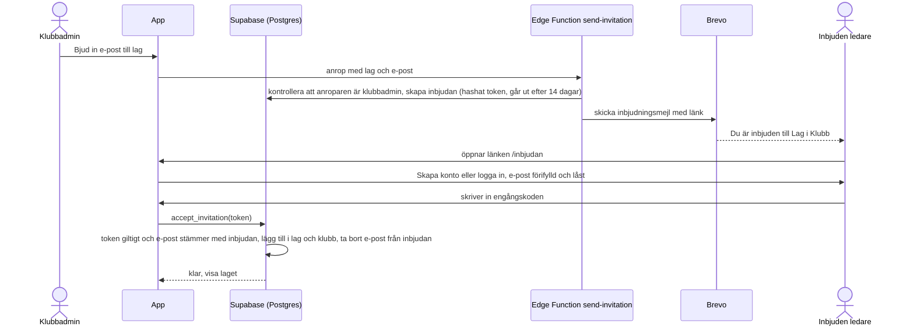

# 0004: Inloggning och inbjudan av ledare

Status: föreslagen

## Kontext

- **Berättelse 08:** en person registrerar sig med e-post och kan logga in och ut. Fel uppgifter ger ett tydligt fel. Bara de personuppgifter som kontot kräver lagras. Inloggningsmetoden är ett tekniskt val (08, *Utanför*).
- **Berättelse 11:** klubbadmin bjuder in en person via e-post till ett visst lag. Personen skapar konto eller loggar in och kopplas till laget, och får bara tillgång till det laget.
- **Berättelse 18:** den som ska bli redaktör måste redan ha ett konto.
- **Användarna** är ideella ledare som använder appen någon gång i veckan, ofta på mobilen och ofta som installerad PWA.
- **E-postkvoter** (ADR 0002): Brevo Free skickar 300 meddelanden per dag. Supabase Auth med egen SMTP startar på 30 meddelanden per timme, och gränsen kan höjas. Supabases inbyggda e-post går inte att använda i produktion.
- **Supabase Auth** stöder lösenord, magisk länk, engångskod via e-post (OTP) och inloggning via externa konton som Google. Allt ingår i gratisnivån upp till 50 000 aktiva användare per månad.
- **Installerade PWA:er på iPhone** har en egen lagring, skild från Safari. En länk i ett mejl öppnas i webbläsaren och inte i den installerade appen, så en inloggning via länk hamnar i fel sammanhang. Det här är känt beteende på iOS och har inte verifierats på enhet i detta uppdrag.
- `docs/design/skisser/14-inloggning.md` utgår från lösenord och har länken ”Glömt lösenord?”.

## Beslut

### Inloggningsmetod: engångskod via e-post, utan lösenord

1. **Skapa konto:** personen anger namn och e-post. Supabase skickar en sexsiffrig kod (`signInWithOtp` med `shouldCreateUser: true`). Personen skriver in koden i appen, kontot skapas och personen är inloggad. Namnet skickas med som metadata, och en trigger skapar raden i `profiles` (ADR 0003). Inget annat lagras (08.5).
2. **Logga in:** personen anger e-post, får en kod och skriver in den (`shouldCreateUser: false`, så att ett felskrivet e-postnamn inte skapar ett nytt konto).
3. **Fel kod, gammal kod eller för många försök** ger ett tydligt felmeddelande, och personen loggas inte in (08.3). Koden gäller i 10 minuter. Supabase standard är längre.

   **Gränserna är ett krav, inte en inställningsdetalj** (S-18). En sexsiffrig kod har bara 10^6 möjligheter, och eftersom det inte finns något lösenord som andra faktor tar den som gissar rätt över kontot helt. Kan flera koder till samma adress vara giltiga samtidigt och antalet försök inte är hårt begränsat, går det att beställa många koder och gissa parallellt. Följande värden gäller och **verifieras mot det faktiska Supabase-projektet i inkrement 3**, eftersom de inte går att fastställa utan ett projekt att läsa inställningarna i:
   - högst 5 verifieringsförsök per kod, varefter koden ogiltigförklaras
   - en ny kod ogiltigförklarar den föregående
   - minst 60 sekunders väntan mellan beställningar
   - kodlängd 8 om Supabase tillåter det
   - Supabase Auths timgräns satt till 100 (se *E-postbudget*)

   Turnstile i punkt 7 är ett komplement till de här gränserna, aldrig en ersättning.
4. **Mejlet innehåller bara koden, inte en inloggningslänk.** Koden skrivs in där personen är, i webbläsaren eller i den installerade appen. Då uppstår inte problemet med att en länk öppnas i fel sammanhang på iPhone.
5. **Sessionen** hanteras av supabase-js: en åtkomsttoken som gäller i en timme och en förnyelsetoken med rotation. Ledaren förblir inloggad på enheten tills hen loggar ut. Det gör att koder skickas sällan och att appen fungerar på planen utan ny inloggning (ADR 0005). Utloggning tar bort sessionen på enheten (08.4).
6. **Mejlmallarna** skrivs på svenska och versionshanteras i `supabase/templates/`. Texterna hämtas från `docs/design/texter.md` när UX-designern har skrivit dem.
7. **Skydd mot missbruk:** registreringen är öppen enligt 08.1, så vem som helst kan få appen att skicka mejl till valfri adress. Därför föreslås **Cloudflare Turnstile**, ett gratis CAPTCHA-alternativ som Supabase Auth stöder, framför begäran om kod. Det är en ny extern tjänst och kräver säkerhetsagentens granskning och användarens beslut, se *Konsekvenser*.

### Inbjudan av ledare

1. **Inbjudningar är egna rader** i `invitations` (ADR 0003): lag, e-post, hashat token (bara hashen lagras), utgångsdatum och vem som bjöd in. En Edge Function, `send-invitation`, kontrollerar att anroparen är klubbadmin i lagets klubb, skapar raden och skickar mejlet via Brevos API. Brevonyckeln finns bara som hemlighet i Edge Function.

   **Token ligger i URL-fragmentet, `/inbjudan#token=...`, inte i frågesträngen** (S-14). En frågesträng hamnar i webbläsarhistoriken, i delade skärmdumpar och i `Referer` mot varje extern resurs sidan laddar, till exempel Turnstiles skript hos Cloudflare. Ett fragment skickas aldrig till någon server. Appen tar dessutom bort token ur adressfältet med `history.replaceState` direkt efter läsning, och `Referrer-Policy: no-referrer` sätts i ADR 0002 (S-17). Token är minst 128 bitar slumpmässig, bara SHA-256-hashen lagras, uppslagningen sker på hashen, och antalet misslyckade uppslagningar begränsas per IP. Byggs i inkrement 3.
2. **Supabases inbyggda `inviteUserByEmail` används inte.** Den skapar ett konto i `auth.users` innan personen har tackat ja, och den bygger på en inloggningslänk, med samma problem på iPhone som ovan.
3. **Personen accepterar** genom att öppna länken, logga in eller skapa konto med engångskod, och sedan anropar appen `accept_invitation(token)`. Funktionen kräver att den inloggades e-post är samma som inbjudans, utan hänsyn till versaler och gemener. En vidarebefordrad länk fungerar alltså bara för den som har tillgång till den inbjudna adressen. Personen läggs till i `team_members` och vid behov i `club_members` (11.2).
4. **Kopiera länk:** klubbadmin kan också kopiera inbjudningslänken och skicka den på annat sätt, till exempel i lagets chatt. Eftersom inbjudan är bunden till e-postadressen är det lika säkert, och det sparar på e-postkvoten. Gränssnittet bestäms av UX-designern.
5. **Inbjudan går ut efter 14 dagar** och kan återkallas av klubbadmin. E-postadressen tas bort från raden när inbjudan accepteras och rensas senast 30 dagar efter att den gått ut eller återkallats, med ett schemalagt jobb i `pg_cron`, som ingår i Supabase.
6. **Gräns per klubb:** högst 50 inbjudningsmejl per klubb och dygn, upprätthållet i Edge Function. Det skyddar den gemensamma e-postkvoten mot misstag och missbruk.

### Utse redaktör

En redaktör söker upp ett befintligt konto på e-postadress med en funktion som bara redaktörer kan anropa (ADR 0003). Finns inget konto visas det (18.2). Inget mejl skickas.

### E-postbudget

| Händelse | Mejl | Uppskattning för en klubb |
|---|---|---|
| Skapa konto | 1 kod | Engångshändelse per ledare |
| Logga in på en ny enhet eller efter utloggning | 1 kod | Några per ledare och säsong |
| Inbjudan | 1 inbjudan och 1 kod | Koncentrerat till säsongsstarten |
| Redaktören sätter `atgarda` | 0 i version 1 (visas i appen, ADR 0003) | – |

Även en säsongsstart där 100 ledare bjuds in samma dag ger ungefär 200 mejl, under Brevos 300 per dag. Supabase Auths gräns sätts till 100 per timme, som tar hand om koderna. Inbjudningarna skickas direkt via Brevo och räknas inte mot den gränsen. Om flera klubbar ansluter blir 300 per dag den verkliga gränsen. Då behövs Brevos betalnivå eller en annan leverantör, och det kräver användarens beslut.

## Alternativ

**E-post och lösenord, som skissen utgår från.** Fördelen är att ingen kod behöver mejlas vid varje inloggning, vilket sparar kvot. Det valdes bort av tre skäl:
- Ideella ledare som använder appen sällan glömmer lösenord, och återställning kräver ändå mejl.
- Lösenord återanvänds och läcker. Supabases kontroll mot läckta lösenord ingår enligt min kännedom inte i gratisnivån. Det har inte verifierats i detta uppdrag.
- Appen skulle behöva två flöden, inloggning och återställning, i stället för ett.

**Magisk länk.** Kräver inget lösenord, men länken öppnas i webbläsaren i stället för i den installerade appen på iPhone. Ledaren blir då inloggad på fel ställe. Valdes bort.

**Inloggning med Google, Microsoft eller Apple.** Går snabbt för många. Det valdes bort i version 1 eftersom det innebär nya externa tjänster och personuppgiftsbiträden. Alla ledare har inte heller ett sådant konto, så e-postinloggning behövs ändå. Kan läggas till senare utan att datamodellen ändras.

**Inbjudningskod eller länk som inte är bunden till e-post** (”alla med länken får gå med”). Sparar mejl, men en länk som sprids ger vem som helst tillgång till lagets material. Valdes bort. Kopiera länk (punkt 4 ovan) ger samma besparing utan den risken.

**Supabases `inviteUserByEmail`.** Se punkt 2 under Inbjudan av ledare.

## Konsekvenser

- **Skiss och texter behöver ändras:** `docs/design/skisser/14-inloggning.md` och `texter.md` behöver ett kodsteg i stället för lösenordsfält och ”Glömt lösenord?”. Det är UX-designerns område och ändras inte här. Det står i rapporten.
- **Den som byter enhet eller loggar ut behöver tillgång till sin e-post** för att logga in igen. Det ska göras hemma, inte på planen. Sessionen finns kvar tills ledaren loggar ut (punkt 5 under Inloggningsmetod).
- **Leverans av e-post blir kritisk:** om Brevo inte levererar, eller om kvoten är slut, kan ingen ny person logga in. Befintliga sessioner fungerar som vanligt.

  **Ingen egen domän köps** (användarens beslut 2026-09-12, ADR 0002). SPF, DKIM och DMARC kan därför inte sättas upp för en egen avsändardomän, och mejl från en avsändare utan autentiserad domän hamnar oftare i skräpposten. Med engångskod som enda inloggningsväg är följden allvarligare här än i en app med lösenord: ett mejl i skräpposten betyder att ledaren inte kommer in alls, och det finns ingen annan väg förbi. Detta är en **känd och accepterad risk**.

  Planen är att **mäta i inkrement 3**, när inloggningen byggs: räkna hur ofta en begärd kod aldrig leder till en inloggning, och prova mot Gmail, Outlook och en operatörsadress. Fastnar mejlen i skräpposten **lyfts domänfrågan till användaren igen**, eftersom en egen domän då är den enda verkliga lösningen. Om Brevos gratisnivå över huvud taget tillåter en avsändare utan egen domän är inte bekräftat: `help.brevo.com` svarade HTTP 403 vid kontrollen 2026-09-12. Se *Beslut som behövs* i rapporten.
- **Kontot går att räkna ut:** eftersom inloggningen har `shouldCreateUser: false` kan svaret avslöja om en e-postadress har ett konto, och någon kan prova adresser till kända personer i föreningen för att se vilka som är ledare i appen (S-13). Åtgärden är beslutad: **svaret ser alltid likadant ut** och flödet går alltid vidare till kodsteget, med texten ”Om adressen finns hos oss har vi skickat en kod.” Detta krockar inte med kriterium 08.3, som gäller **fel kod** — där ska felmeddelandet fortsatt vara tydligt. Undantaget är redaktörens uppslagning (18.2), som med nödvändighet röjer att ett konto finns; den begränsas i stället till exakt fullständig adress med tak per redaktör och dygn (ADR 0003, S-15). Byggs i inkrement 3.
- **Turnstile** innebär en ny extern tjänst, Cloudflare, som redan är webbhotell enligt ADR 0002. Utan Turnstile kan en angripare tömma e-postkvoten, och då kan ingen logga in den dagen. **Säkerhetsagenten tillstyrker** (granskning-k2, avsnitt 4): Cloudflare är redan biträde och ser redan samma uppgifter som CDN, Turnstile är i normalfallet icke-interaktivt och därmed bättre för WCAG 2.2 AA än bildbaserade alternativ, och det är gratis. Villkoren är att tjänsten nämns i integritetspolicyn, att den tas med i `connect-src` i innehållspolicyn (ADR 0002, S-17) och att den aldrig ersätter gränserna i punkt 3.
- **Sessioner kan inte tidsbegränsas på gratisnivån** enligt min kännedom. Tidsbegränsade sessioner och timeout vid inaktivitet är Pro-funktioner i Supabase, och Supabase Pro är avförd (ADR 0002). Det har inte verifierats i detta uppdrag.

  **Den borttappade telefonen är en känd och accepterad risk** (S-11). En ledare som tappar sin olåsta telefon på planen ger upphittaren tillgång till lagets pass, klubbens övningar och namnen på klubbens övriga ledare, utan tidsgräns. Säkerhetsagenten bedömer risken som godtagbar för det här innehållet, men rekommenderade ”Logga ut på alla enheter” (`supabase.auth.signOut({ scope: 'global' })`, ingår i gratisnivån) i version 1. **Användaren beslutade 2026-09-12 att den funktionen inte ingår i version 1.** Följden är att ledaren i dag inte har något sätt alls att avbryta åtkomsten från en förlorad enhet: att logga ut på en annan enhet tar bara bort den enhetens session. Den som behöver det får kontakta användaren, som kan återkalla sessionen i Supabase dashboard. Funktionen är några rader kod och kan läggas till i en senare version utan att något annat ändras.

  Det verkliga skyddet för förnyelsetoken, som ligger i localStorage, är innehållspolicyn i ADR 0002 (S-17), inte lagringsvalet. Se även ADR 0005 om cachen på en delad enhet (S-12).
- **Radering av konto ingår i version 1** (S-10, användarens beslut 2026-09-12). Sista steget, att ta bort raden i `auth.users`, ligger i ett schema som appen inte kommer åt och görs därför av en Edge Function med servicenyckeln, på samma sätt som `send-invitation`. Funktionen och vad som händer när den sista klubbadminen raderar sig beskrivs i ADR 0003, *Radering av konto*.
