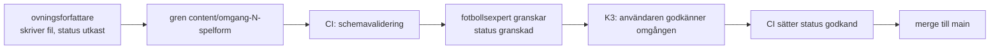

# 0010: Övningsformat, lagring och vägen in i banken

Status: beslutad (K2, 2026-09-12)

## Kontext

ADR 0003 beskriver övningen som entitet men lämnar innehållsfälten, filformatet och kolumnvalen till del B. `docs/doman/generatorregler.md` R-001 till R-009 anger vilka uppgifter generatorn behöver, och fotbollsexperten lämnade fältnamnen till K2. Den här ADR:n bestämmer:

- **Schemat** för en övning: fältnamn, typer, vilka fält som krävs för en bankövning och vilka som krävs för att en egen övning ska kunna bytas in (R-106).
- **Var övningarna bor** och hur de tar sig från övningsförfattaren till appen, både i fas 3 (innan appen finns) och efteråt.
- **Hur det skyddas tekniskt** att ingen agent kan sätta status `godkand` (`CLAUDE.md`, berättelse 16, kriterium 4).
- **Hur schemat valideras** lokalt och i CI (uppdraget för fas 2).

Följande ramar styr besluten:

| Ram | Källa |
|---|---|
| Övningens data ska gå att kontrollera automatiskt, och en övning som bryter mot R-001 till R-009 får inte användas av generatorn | `generatorregler.md`, grupp 1 |
| Generatorn väljer bara ur den gemensamma banken med status `godkand` | R-022 |
| En egen övning kan bytas in för hand om den har och uppfyller R-001 till R-009 samt namn, syfte och beskrivning | R-106 |
| En egen övning får sparas ofullständig och ska ändå gå att dela inom klubben | Berättelse 13, kriterium 2 |
| En övning publiceras i banken först när en människa har godkänt den. Ingen agent får sätta `godkand` | `CLAUDE.md`, berättelse 16, kriterium 4 |
| Övningsbanken versioneras i `content/ovningar/`, skrivs av ovningsforfattare och granskas av fotbollsexpert | `CLAUDE.md`, `content/ovningar/README.md` |
| Banken lagras i Postgres och läses av alla inloggade. Innehållet ligger i `content` (jsonb), och del B avgör vilka fält som får egna kolumner | ADR 0003 |
| TypeScript i `strict`, Zod för validering, Vitest för tester. `src/regelmotor/` får inte importera React, webbläsar-API:er eller Supabase | ADR 0001 |
| CI är GitHub Actions, och tunga jobb begränsas till relevanta sökvägar för att spara minuter | ADR 0002 |
| Planskissens inre format ägs av planskissutvecklaren och beslutas senare | `CLAUDE.md`, berättelse 06 |

Övningarna skrivs av människor och agenter i text, granskas i diffar och ska gå att läsa utan verktyg. Samtidigt ska exakt samma fältdefinition gälla för klubbens egna övningar i appen, eftersom R-106 kräver att villkoren prövas likadant där. Schemat måste därför finnas på ett ställe och kunna köras både i ett skript och i klienten.

## Beslut

### 1 Schemat

**En övning är en YAML-fil**, `content/ovningar/<id>.yaml`, en fil per övning i en platt mapp. `<id>` är övningens stabila ID och `source_id` i ADR 0003: gemener, siffror och bindestreck, 3–64 tecken, bara ASCII. Filnamnet och fältet `id` ska vara lika. Ett ID ändras aldrig och återanvänds aldrig.

**Schemat definieras en gång, i Zod**, i `src/regelmotor/schema/ovning.ts`. Samma schema används av valideringsskriptet, av importen och av appens formulär för egna övningar, så att R-106 prövar exakt samma villkor som banken. Filer som börjar med `_` och allt som inte är `.yaml` hoppas över.

#### Fälten

`Bank` = krävs för att en fil ska få status `granskad` eller `godkand`. `R-106` = krävs för att en egen övning ska kunna bytas in i ett pass. `Kolumn` = fältet får en egen kolumn i `exercises` för filtrering och sortering, utöver att det ligger kvar i `content`.

| Fält | Typ och regel | Bank | R-106 | Kolumn |
|---|---|---|---|---|
| `schema` | Heltal, versionen av det här schemat. Nu `1` | ja | – | – |
| `id` | Slug, samma som filnamnet | ja | – | `source_id` |
| `namn` | Text 3–60 tecken | ja | ja | `name` |
| `syfte` | Text 10–200 tecken, en mening | ja | ja | – |
| `beskrivning` | Text, minst 40 tecken | ja | ja | – |
| `organisation` | Text: uppställning, grupper och rotation | ja | nej | – |
| `fokusomraden` | Lista med 1–3 olika nycklar ur `fokusomraden.md`. Den första är huvudfokus (R-002) | ja | ja | `focus_areas text[]`, `main_focus text` |
| `alder` | `{ min, max }`, heltal, 6 ≤ min ≤ max ≤ 19 (R-003) | ja | ja | `age_min`, `age_max` |
| `spelformer` | Lista med 1–5 nycklar ur `spelformer.md` (R-004) | ja | ja | `game_formats text[]` |
| `niva` | Lista med 1–3 av `niva-1`, `niva-2`, `niva-3`, utan dubletter. Innehåller listan `niva-1` och `niva-3` måste den också innehålla `niva-2` (R-001) | ja | ja | `levels text[]` |
| `passdelar` | Lista med 1–4 av `del-uppvarmning`, `del-ovning`, `del-spelovning`, `del-spel`. `del-avslutning` är förbjuden (R-005) | ja | ja | `session_parts text[]` |
| `ledarbehov` | Heltal 0, 1 eller 2 per grupp (R-006) | ja | ja | `coach_need` |
| `ledaruppgift` | Text: vad ledaren gör. Krävs när `ledarbehov` ≥ 1 | ja | nej | – |
| `spelare` | `{ min, max }`, heltal per grupp, 1 ≤ min ≤ max ≤ 40 (R-007) | ja | ja | `players_min`, `players_max` |
| `grupptyp` | En av `fri`, `par`, `tva-lag`, `fast-storlek` (R-008) | ja | ja | `group_type` |
| `udda_antal_losning` | Boolean. Krävs och tillåts bara när `grupptyp` är `fast-storlek` (R-008, R-050) | villkorat | villkorat | `odd_player_solution` |
| `tid` | `{ kortast, rekommenderad, langst }` i hela minuter, 5 ≤ kortast ≤ rekommenderad ≤ langst (R-009) | ja | ja | `minutes_min`, `minutes_recommended`, `minutes_max` |
| `yta` | Karta från spelformsnyckel eller `alla` till `{ langd, bredd }` i meter (R-092) | ja | när ledaren valt yta (R-093) | `has_area boolean` |
| `material` | Lista med `{ typ, antal, anteckning }`. `typ` är en slug, och `mal` är den typ R-084 läser | ja | nej | – |
| `coachningspunkter` | Lista med 2–4 texter | ja | nej | – |
| `varianter` | `{ lattare, svarare }`, båda text | ja | nej | – |
| `anpassning` | `{ fler_spelare, udda_antal, ledare }`, alla text | ja | nej | – |
| `planskiss` | Reserverat. Se nedan | nej | nej | – |
| `kalla` | Text: inspiration eller källa | nej | nej | – |
| `status` | En av `utkast`, `granskad`, `atgarda`, `godkand`. **Finns bara i filen**, aldrig i databasen | ja | – | – |
| `granskning` | Lista med `{ datum, av, roll, kommentar }`. Krävs för `granskad`, `atgarda` och `godkand` | ja | – | – |

Ändringar mot den preliminära listan i `content/ovningar/README.md`: `niva` blir en lista (R-001), `tid` får tre värden i stället för ett (R-009), `yta` anges per spelform (R-092), och `ledare` delas i `ledarbehov` (R-006) och `ledaruppgift`. `passdelar`, `grupptyp` och `udda_antal_losning` är nya (R-005, R-008).

#### Regler som schemat kontrollerar utöver fälttyperna

| Kontroll | Regel |
|---|---|
| Varje fokusområde är K eller R för varje fas som `alder` berör | R-002 |
| Varje spelform i `spelformer` är tillåten för minst en ålder i `alder` | R-004 |
| `par` och `tva-lag` kräver `spelare.min` ≥ 2 | R-008 |
| `fast-storlek` kräver `spelare.min` = `spelare.max` ≥ 2, och `udda_antal_losning` ifylld | R-008 |
| En övning med `del-spel` i `passdelar` har `grupptyp: tva-lag` | R-008 |
| Nycklarna i `yta` är `alla` eller finns i `spelformer`, och varje spelform i `spelformer` täcks av exakt en nyckel | R-092 |
| Har övningen `nickspel` bland `fokusomraden` är `alder.min` minst 13 | R-081 |

Schemat kontrollerar inte om en övning som innehåller nickning saknar märkningen `nickspel`. Det är en fotbollsfacklig bedömning som fotbollsexperten gör vid granskningen, och andra stycket i R-081 gäller där.

#### Nickning, planskiss och det som databasen inte får

- **`nickspel` är ett fokusområde**, inte ett eget fält. Märkningen är därför alltid synlig i `fokusomraden`, generatorn läser den där (R-080, R-082, R-083), och `main_focus` och `focus_areas` gör den sökbar. Ledaren märker själv sin egna övning, eftersom formuläret inte frågar om nickning i version 1 (berättelse 13, *Utanför*).
- **`planskiss` valideras fullt ut när fältet finns.** Fältet får saknas, och övningar utan planskiss är tillåtna i banken (berättelse 06, kriterium 2). Finns det, prövas det mot planskissutvecklarens Zod-schema i ADR 0012, som `src/regelmotor/schema/ovning.ts` importerar.

  **Detta är en ändring.** Fältet var tidigare reserverat och ogenomskinligt för valideringen, med raden ”valideringen underkänner alltså aldrig en övning på grund av skissens innehåll”. Den raden går inte att förena med S-07, vilket planskissutvecklaren påpekar i ADR 0012 avsnitt 6: samma fält fylls av ledare i appen, och skissdata från en ledare är innehåll som en angripare styr fullt ut och som sprids till alla klubbar när en inskickad övning godkänns. Undantaget kunde på sin höjd ha gällt repofiler, som passerar mänsklig granskning i en diff, men två valideringsnivåer för samma fält är en onödig skarv och skulle betyda att en repofil kan innehålla skissdata som appen sedan inte kan rita. Med ADR 0012 finns ett fullständigt schema, och då finns inget skäl kvar att låta fältet vara ogenomskinligt någonstans. Valideringsskriptet i avsnitt 5 underkänner alltså en repofil med ogiltig skiss.

  Storleken begränsas dessutom i databasen med en `check` på `pg_column_size(content -> 'planskiss') < 8192` (ADR 0012, S-08). Ritmotorns egna krav — sluten formlista, bara primitiva värden, bara React-element, aldrig `foreignObject`, aldrig `dangerouslySetInnerHTML` — ägs av ADR 0012.
- **Kolumnerna är genererade**, `generated always as (...) stored` ur `content`, med en liten `immutable` hjälpfunktion för listorna. Då kan kolumn och innehåll inte glida isär, och de kan indexeras: btree på `age_min`, `age_max` och `minutes_min`, GIN på `focus_areas`, `game_formats`, `levels` och `session_parts`.
- **En övning är komplett** när alla kolumner ovan som är märkta `R-106` är ifyllda och `name` samt `syfte` och `beskrivning` i `content` inte är tomma. Vyn `club_exercises_v` räknar fram `ar_komplett` ur kolumnerna och **skapas med `with (security_invoker = true)`** (S-02). Utan flaggan körs vyn med vyägarens rättigheter och utvärderar aldrig RLS på `exercises`, så en ledare i klubb A skulle få tillbaka samtliga klubbars egna övningar med fritext och allt, utan att någon policy överträds. ADR 0003 princip 1 gör flaggan till en CI-kontroll för varje vy i `public`. Samma villkor används av listan över klubbens övningar (berättelse 13, kriterium 2), av bytesdialogen (R-106) och av `submit_exercise` (berättelse 15, kriterium 2). Ofullständiga egna övningar sparas som de är: fälten saknas i `content`, och kolumnerna blir null.
- **Ytfiltret (R-092) räknas i regelmotorn**, inte i SQL, eftersom det beror på antal grupper och marginaler. `has_area` finns bara för att snabbt kunna sortera bort övningar utan yta (R-093).

### 2 Flödet in i banken

**Repot är källan.** Bankens övningar skrivs som filer i `content/ovningar/`, versioneras i git och läses in i databasen av ett CI-jobb. Databasen är en kopia som appen läser, inte originalet. Ingen i appen kan ändra en bankövning som kommer från repot (ADR 0003).

**Banken är licensierad under CC BY-SA 4.0** (användarens beslut 2026-09-12, `content/LICENSE`, ADR 0002). Licensen gäller allt under `content/`: övningarnas texter och deras skissdata. Koden licensieras separat under Apache-2.0. Den som kopierar en övning ska alltså ange Fotbollsbanken som källa och dela vidare under samma licens. Det gäller vårt eget innehåll: övningarna bygger på principerna i SvFF:s spelarutbildningsplan men innehåller inte SvFF:s texter, och SvFF:s material omfattas inte av licensen (`CLAUDE.md`). Fältet `kalla` i avsnitt 1 är övningens egen inspirationsangivelse och något annat än licensens erkännandekrav; det är fortsatt valfritt.

#### Fas 3, innan appen finns



1. Övningsförfattaren skapar en fil per övning med `status: utkast` på grenen `content/omgang-<N>-<spelform>`.
2. Varje push kör schemavalideringen (avsnitt 5). En `utkast`-fil måste gå att läsa och följa schemats typer. Först vid `granskad` och `godkand` krävs alla bankfält.
3. Fotbollsexperten granskar, lägger till en rad i `granskning` och sätter `granskad`, eller `atgarda` med kommentar. Övningsförfattaren åtgärdar och sätter tillbaka `utkast`.
4. Vid K3 lägger huvudsessionen fram omgången. Användaren godkänner den i pull requesten, och CI sätter `godkand` (avsnitt 3). Ingen människa och ingen agent skriver `godkand` för hand.
5. Omgången mergas till `main`. Så länge appen inte finns är filerna hela banken, och inget mer händer.

#### När appen finns

6. **Import.** Ett jobb, `importera-banken`, körs vid push till `main` när något under `content/ovningar/**` har ändrats, och kan även startas manuellt. Det körs aldrig för en pull request. Jobbet använder **importrollen `importer`, inte servicenyckeln** (S-05, ADR 0003). Rollen saknar `bypassrls`, har inga tabellrättigheter och får bara anropa `import_bank_exercises(jsonb)`, som i sin tur bara kan skriva rader med `scope = bank` och `origin = repo` och sätta `retired_at`. Nyckeln ligger som miljöhemlighet i en GitHub Environment med krav på godkännande. Jobbet gör, i en transaktion:
   - läser alla filer, validerar dem på nytt och avbryter utan att skriva om något fel hittas,
   - `upsert` på `source_id` av varje fil med `status: godkand` till `exercises` med `scope = bank` och `origin = repo`. Oförändrat innehåll hoppas över med hjälp av en hash,
   - sätter `retired_at` på rader vars fil har fått en annan status eller har försvunnit, och nollställer `retired_at` om filen blir godkänd igen.
   
   Jobbet läser aldrig `status` från databasen och skriver aldrig `status` till en fil. Det körs mot staging vid varje merge och mot produktion efter kontrollpunkten, med samma manuellt startade arbetsflöde som migrationerna (ADR 0002).
7. **Appen** läser bankövningar ur databasen efter inloggning och cachar dem lokalt (ADR 0005). En ny omgång syns för ledaren efter nästa hämtning.

#### Vägen via redaktörskön i appen

En egen övning som en klubb skickar in når banken utan att passera repot:

| Steg | Vad som händer | Var |
|---|---|---|
| Ledaren skapar en övning | Rad i `exercises` med `scope = club`, får vara ofullständig | Appen |
| Ledaren skickar in | `submit_exercise` kontrollerar att övningen är komplett och skapar en rad i `submissions` med status `inskickad` och en ögonblicksbild | Appen |
| Redaktören godkänner | `approve_submission` skapar en ny rad i `exercises` med `scope = bank` och `origin = submission`, från ögonblicksbilden | Appen |
| Generatorn | Väljer den nya övningen som vilken bankövning som helst (R-022) | Appen |

**En inskickad övning bidras under CC BY-SA 4.0, och det ska framgå vid inskickningen** (användarens beslut 2026-09-12). Godkänns övningen blir den en del av den gemensamma banken, sprids till alla klubbar och blir fritt vidareanvändbar av utomstående när repot är publikt. Det är en följd ledaren behöver känna till innan knappen trycks, inte efteråt:

- Steget före `submit_exercise` visar en kort text om att övningen bidras under CC BY-SA 4.0, med länk till licensen. Utformningen — en mening vid knappen eller en kryssruta — ägs av UX-designern. Texten saknas i `texter.md` i dag och behöver beställas (berättelse 15).
- Ledarens egen övning i klubben påverkas inte. Det som licensieras är kopian som `approve_submission` skapar (`scope = bank`, `origin = submission`).
- Godkända inskickningar ligger bara i databasen och inte i `content/`, så `content/LICENSE` täcker dem inte i filform. Villkoret bärs i version 1 av texten vid inskickningen. Byggs exporten till repot som nämns under *Konsekvenser* senare, hamnar de under filens licens, vilket är ytterligare ett skäl att villkoret är tydligt redan nu.
- Samma villkor ska nämnas i den information som tas fram inför lanseringen (fas 5).

**Godkända inskickningar skrivs inte tillbaka till repot i version 1.** Banken har därmed två ursprung: filerna (`origin = repo`) och de godkända inskickningarna (`origin = submission`). Konsekvensen och förslaget på en export tas upp under *Konsekvenser* och i rapporten.

### 3 Godkännandet

Agenterna kör lokalt med användarens git och kan tekniskt skriva vad som helst i en fil. Ordet `godkand` i en fil kan alltså inte i sig vara beviset på ett mänskligt godkännande. Skyddet bygger därför på en annan princip:

> **Ingen människa och ingen agent skriver `godkand` i en fil. Värdet skrivs bara av ett arbetsflöde i GitHub Actions, och bara som svar på att användaren har godkänt en pull request med sitt eget GitHub-konto.**

Det som en agent inte kan förfalska är händelsen `pull_request_review` med `state: approved` från en kodägare. Den kräver användarens inloggning hos GitHub, inte skrivrättighet till arbetskatalogen.

#### Fyra lager

| Lager | Vad det gör | Var |
|---|---|---|
| 1. Grenskydd | `main` tar inte emot direkta pushar. Ändringar går via pull request, och `CODEOWNERS` kräver granskning av användaren för `content/ovningar/**`, `.github/workflows/**` och `supabase/migrations/**` | GitHub |
| 2. Kontroll `godkannande` | Körs på varje pull request. Underkänner bygget om en commit som inte är gjord av arbetsflödet nedan ändrar en `status:`-rad till `godkand`, och om en pull request som innehåller godkännanden också ändrar filer utanför `content/ovningar/**` | CI |
| 3. Arbetsflöde `godkann-omgang` | Startas av `pull_request_review` med `state: approved` från kodägaren. Sätter `status: godkand` på filerna i pull requesten som har `granskad`, lägger till en rad i `granskning` med datum och användarens GitHub-namn, och pushar en commit till grenen. Rör aldrig en fil med `utkast` eller `atgarda` | CI |
| 4. Import | Läser bara filer med `godkand` och skriver aldrig status. Körs med importrollen, som inte kan skapa ett godkännande i appen | CI |

Arbetsflödet i lager 3 använder GitHub Actions egen token, och kontrollen i lager 2 känner igen dess commits på författaren `github-actions[bot]`. Tokenen får bara `contents: write` och `pull-requests: read`, och förvalt `GITHUB_TOKEN`-läge för repot sätts till read-only.

#### Lager 1 är verkligt från och med nu

Lager 1 fanns tidigare bara på pappret: skyddade grenar kräver enligt uppgift en betald GitHub-plan för privata repon, så i praktiken kunde vem som helst med skrivrättighet — varje agent som kör med användarens git inräknad — pusha `status: godkand` direkt till `main` (S-04). Hela den mänskliga godkännandegarantin vilade då på arbetsflödet i `CLAUDE.md`, inte på teknik.

Användaren beslutade 2026-09-12 att **repot görs publikt före fas 4 och att `main` skyddas** med grenskydd och `CODEOWNERS`. Huvudsessionen förbereder repot. Grenskydd blir därmed gratis, och lager 1 blir en teknisk spärr i stället för en överenskommelse. Villkoren för publiceringen står i ADR 0002.

#### Lager 3 måste binda godkännandet till en commit

Händelsen `pull_request_review` bär den commit som granskades, `review.commit_id`, men det räcker inte att arbetsflödet startar av den (S-03). Checkar det ut grenens huvud kan en agent pusha en ny commit sekunden efter användarens Approve, och arbetsflödet stämplar `godkand` på övningstext som användaren aldrig läst. Samma händelse ger dessutom `contents: write` och tillgång till hemligheter, så kod från grenen får inte köras. Arbetsflödet byggs därför så här:

| Krav | Varför |
|---|---|
| Checka ut exakt `github.event.review.commit_id`, jämför med `pull_request.head.sha` och avbryt vid skillnad | Godkännandet gäller en commit, inte en gren |
| Slå på ”Dismiss stale pull request approvals when new commits are pushed” i grenskyddet | Ett Approve ska inte överleva en ny commit |
| Verifiera att granskaren är kodägare | `pull_request_review` utlöses av vilken granskare som helst |
| Kräv att lager 2 har grönt för samma SHA innan lager 3 kör | Annars kan en pull request som ändrar arbetsflöden själv godkännas |
| Kör bara betrodd kod från basgrenen, aldrig `npm ci` eller skript från PR-grenen | `npm ci` med ändrade `scripts`, eller ett ändrat `scripts/validera-ovningar.ts`, kör annars en agents kod med skrivrättighet till repot |

Inga arbetsflöden utlöses av `pull_request_target`, och inga hemligheter ges till arbetsflöden som utlöses av pull requests från forkar.

**För användaren** blir godkännandet ett klick: öppna omgångens pull request, läsa igenom övningarna och trycka Approve. Statusraderna sätts av CI, valideringen körs om, och huvudsessionen mergar. Vill användaren godkänna bara några av övningarna i en omgång går de andra tillbaka till `atgarda` innan granskningen.

#### I appen

| Skydd | Hur |
|---|---|
| Klienten kan inte skriva `status` | RLS ger ingen `update`-rättighet på `submissions`. Statusen ändras bara av `submit_exercise`, `approve_submission` och `return_submission` (ADR 0003) |
| Bara redaktörer kan godkänna | `approve_submission` är `security definer` med låst `search_path` och avbryter om `is_editor()` är falskt |
| Importen kan inte godkänna | Importrollen saknar `bypassrls` och kan bara anropa `import_bank_exercises`, som är begränsad till `origin = repo` och aldrig sätter `approved_by` (S-05) |
| Importen kan inte skapa ett godkännande | En `check` på `exercises` kräver att `origin = submission` alltid har `approved_by` satt, och `approved_by` sätts bara av `approve_submission` |
| Ingen automatik | Det finns ingen trigger och inget schemalagt jobb som sätter `godkand`. Kvalitetssäkraren får ett pgTAP-test som visar att varje annan väg nekas |
| Spårbarhet | Varje godkännande blir en rad i `submission_events` med `actor_id` och tidpunkt, och i repot en commit med användarens granskningsrad |

**Rättelse av ett tidigare påstående.** Här stod tidigare att ”servicenyckeln kan inte godkänna”, eftersom `approve_submission` avbryter när `auth.uid()` är null. Påståendet var inte tekniskt sant (S-05). `check`-begränsningen kräver bara att `approved_by` är *satt*, och den som har en nyckel med `bypassrls` kan sätta den till vilket uuid som helst och skriva in en bankövning med `origin = submission` utan att `approve_submission` någonsin körts. Skyddet mot förfalskat godkännande var alltså **organisatoriskt så länge en nyckel med `bypassrls` fanns i CI**. Det är själva skälet till att servicenyckeln tas bort därifrån och ersätts med importrollen: efter den ändringen är skyddet tekniskt. Servicenyckeln finns kvar i Edge Functions (ADR 0004) och hos användaren, och den som har den kan fortfarande skriva vad som helst i databasen — det är oundvikligt och gäller varje Postgres-superanvändare, och det är därför nyckeln inte får finnas i något system som en agent kan ändra.

Ingen agent har ett konto i appen, och det finns ingen inloggning utan e-postbekräftelse (ADR 0004). Även om en agent fick tag i en klientnyckel saknar den en redaktörsroll.

### 4 Ordet ”utkast”

`utkast` betyder i dag tre olika saker. Det gör kraven svårlästa, och i databasen går betydelserna inte att skilja åt (se *Alternativ* i ADR 0003).

| I dag | Betyder | Hör hemma | Nytt värde |
|---|---|---|---|
| `utkast` i berättelse 13 | En egen övning som saknar fält och därför inte kan bytas in i ett pass | `exercises` med `scope = club` | **Inget statusfält.** I stället det härledda `ar_komplett`, som visas som **Ofullständig** eller **Klar att använda** |
| `utkast` i berättelse 15 och 17 | En inskickad övning som väntar på redaktören | `submissions.status` | **`inskickad`** |
| `utkast` i `content/ovningar/README.md` | En fil i repot som väntar på fotbollsexpertens granskning | `status` i filen | **`utkast`**, oförändrat |

Ordet behålls alltså bara där det är riktigt, i repot. En egen övning får ingen granskningsstatus alls, eftersom ingen granskar den: den är antingen komplett eller inte, och det räknas fram ur fälten i stället för att sättas för hand. Redaktörskön får `inskickad`, som är det gränssnittet redan visar (`floden.md`, avsnitt 1.6).

Statusvärdena blir då:

| Plats | Värden |
|---|---|
| Fil i `content/ovningar/` | `utkast` → `granskad` → `godkand`, och `atgarda` tillbaka till `utkast` |
| `submissions.status` | `inskickad` → `godkand`, och `atgarda` tillbaka till `inskickad` |
| `exercises` med `scope = club` | Ingen status. `ar_komplett` är härledd |

#### Ändringar som förslaget kräver

De här dokumenten ägs av andra roller. Jag har inte ändrat dem, och de listas i rapporten under *Beslut som behövs*.

| Fil | Rad eller kriterium | Ändring |
|---|---|---|
| `docs/krav/berattelser/13-skapa-egen-ovning.md` | Kriterium 1 och 2 | ”status `utkast`” utgår. Övningen sparas, och appen visar om den är komplett |
| `docs/krav/berattelser/15-skicka-in-ovning-till-banken.md` | Kriterium 1 | `utkast` i redaktörskön blir `inskickad` |
| `docs/krav/berattelser/17-atgarda-och-skicka-in-igen.md` | Kriterium 2 | Samma ändring |
| `docs/design/floden.md` | Punkt 88, 98 och 107 | Samma ändring, och ”sparas som `utkast`” blir ”sparas som ofullständig” |
| `docs/design/skisser/10-skapa-egen-ovning.md` | Punkt 92 | ”sparas alltid med status `utkast`” blir ”sparas alltid, med markering av vad som saknas” |
| `docs/design/skisser/11-hantera-egna-ovningar.md` | Punkt 100 | ”status till `utkast` i redaktörskön” blir `inskickad` |
| `docs/design/skisser/12-redaktorsko.md` | Punkt 112 | Samma ändring |
| `content/ovningar/README.md` | Statustabellen | Får ett stycke om att filens statusar bara gäller repot, och en hänvisning till `inskickad` i appen |
| `docs/adr/0003-datamodell.md` | `submissions.status` och tillståndsdiagrammet | `utkast` blir `inskickad`. ADR 0003 är fortfarande `föreslagen`, så ändringen kan göras före K2 i stället för i en ny ADR |

Statusraden `Status: utkast` överst i dokumenten i `docs/` är en fjärde användning av ordet, men den gäller dokument och inte övningar, och den berörs inte.

### 5 Validering

**Kommandot** (planerat, finns när fas 4 börjar):

```
npm run validera:ovningar          # alla filer i content/ovningar/
npm run validera:ovningar -- <fil> # en fil, medan man skriver
```

Skriptet ligger i `scripts/validera-ovningar.ts` och körs av Node direkt, utan byggsteg, eftersom Node 24 kör TypeScript med typborttagning (ADR 0001). Det importerar Zod-schemat från `src/regelmotor/schema/ovning.ts` och innehåller ingen egen regelkunskap.

| Kontroll | Underkänner |
|---|---|
| Filen går att läsa som YAML | Alltid |
| Fältnamn, typer och intervall enligt schemat | Alltid |
| `id` är lika med filnamnet, och unikt i mappen | Alltid |
| Korsreglerna R-001 till R-009, R-081 och R-092 | Alltid |
| Alla bankfält ifyllda, och minst en rad i `granskning` | Vid `granskad` och `godkand` |
| `granskning` har en kommentar | Vid `atgarda` |
| `planskiss` mot schemat i ADR 0012, när fältet finns | Alltid (S-07) |
| `granskning.av` och `kalla` innehåller inget `@` och inget mönster som liknar en e-postadress | Alltid (S-21) |

Utdata är en rad per fel med fil, fält och regel-ID, till exempel `spring-och-vand.yaml: fokusomraden – fasta-situationer är "–" för fas-8-9 (R-002)`. Skriptet avslutar med kod 1 om något underkänns.

**I CI** körs valideringen i arbetsflödet `innehall.yml`, som utlöses av ändringar i `content/ovningar/**` och i schemafilen. Den körs också i den fullständiga körningen på `main` och som första steg i `importera-banken`, så att en trasig fil aldrig når databasen. Jobbet tar under en minut och belastar inte Actions-kvoten nämnvärt (ADR 0002).

**Samma schema i appen.** Formuläret för egna övningar validerar med samma Zod-schema, i en variant där alla fält utom `namn` får saknas (berättelse 13, kriterium 2). Bytesdialogen (R-106) kräver den kompletta varianten. Ett test visar att listan över fält som krävs för R-106 är densamma i schemat och i vyn `club_exercises_v`, så att appen och databasen inte kan säga olika saker.

**Tester.** Schemat får Vitest-tester i `src/regelmotor/schema/ovning.test.ts` med minst ett godkänt och ett underkänt fall per regel-ID, R-001 till R-009 samt R-081 och R-092. Testerna namnges med regel-ID så att spårbarheten går att söka fram. Testerna ägs av kvalitetssäkraren.

**Redigeringsstöd.** `z.toJSONSchema()` i Zod 4 skriver ut `content/ovningar/ovning.schema.json`, som ger komplettering och felmarkering i redigeraren. Filen är genererad, checkas in och kontrolleras i CI med `--check`, som underkänner bygget om den inte stämmer med Zod-schemat. Inget nytt beroende krävs.

## Alternativ

| Alternativ | Varför det valdes bort |
|---|---|
| **JSON i stället för YAML** | Kräver inget beroende, men prosafälten (`beskrivning`, `organisation`, `varianter`, `anpassning`) blir en enda lång rad med `\n`, och diffarna blir oläsbara. Granskningen av innehåll sker i diffar, så läsbarheten väger tyngre än ett litet beroende |
| **Markdown med YAML-huvud** | Trevligt att skriva, men innehållet delas i två representationer, och det blir oklart var gränsen går mellan huvudet och brödtexten. Valideringen och importen skulle behöva en egen tolk för brödtexten |
| **En fil per omgång med flera övningar** | Färre filer, men två övningsförfattare som arbetar samtidigt får konflikter i samma fil, och en enskild övnings historik försvinner i git |
| **Mappar per status, till exempel `content/ovningar/godkanda/`** | Skulle göra godkännandekontrollen till en enkel kontroll av filflyttar, men en agent kan flytta en fil lika lätt som den kan ändra en rad, så skyddet blir inte bättre. Sökvägen skulle dessutom ändras vid varje statusbyte |
| **Mappar per spelform** | En övning kan höra till flera spelformer (R-004), så indelningen blir godtycklig. Omgångarna i fas 3 följs i stället via pull requests |
| **JSON Schema som källa i stället för Zod** | Ger validering i flera språk och kan användas av `pg_jsonschema`, men appen behöver ändå typer och formulärvalidering i TypeScript. Med Zod som källa och JSON Schema som genererad produkt finns bara en definition |
| **Kontroll av `content` i databasen med `pg_jsonschema`** | Tillägget skulle kontrollera hela schemat i databasen, men egna övningar är ofullständiga med flit, så villkoret måste ändå vara mildare där. De genererade kolumnernas typer plus kontrollen i `submit_exercise` täcker det som behöver garanteras i databasen. Kan tas in senare för `scope = bank` |
| **Kolumner som fylls av en trigger** | Genererade kolumner kan inte glida isär från `content` och kräver ingen kod. Triggern valdes bort, men blir nödvändig om något fält visar sig kräva ett uttryck som inte är `immutable` |
| **`yta` som en lista med `{ spelformer, langd, bredd }`** | Kartan är kortare och gör R-092:s uppslagning till en direkt nyckelläsning. Listan tillåter dessutom överlapp som schemat skulle behöva leta efter |
| **En egen boolean `har_nickning` på övningen** | Skulle dubbla `nickspel` i `fokusomraden` och kunna säga emot den. Reglerna R-080 till R-083 läser fokusområdena, så märkningen ska finnas där och bara där |
| **Att godkännandet är en statusrad som huvudsessionen skriver efter K3** | Det som skiljer en agent från användaren blir då bara vem som påstår sig ha skrivit raden. Ett Approve i GitHub kräver användarens konto och går inte att förfalska lokalt |
| **Att skriva övningarna direkt i databasen via ett redaktörsgränssnitt** | Skulle ta bort importen, men banken skulle förlora versionshistorik, granskning i diffar och möjligheten att bygga upp den innan appen finns. Fas 3 pågår parallellt med fas 4 och kan inte vänta på appen |

## Konsekvenser

**Fördelar**

- Fältdefinitionen finns på ett ställe. Samma Zod-schema avgör vad en bankövning måste ha, vad appens formulär kräver och vilka egna övningar som kan bytas in (R-106), så de kan inte säga emot varandra.
- Varje regel i grupp 1 blir kontrollerbar innan en övning kommer in i banken, vilket är just det R-001 till R-009 finns för.
- Banken kan byggas i fas 3 utan att appen finns, och samma filer blir databasinnehåll utan omarbetning när importen kommer.
- Vägen till `godkand` går genom en händelse som bara användarens GitHub-konto kan skapa. Godkännandet kostar användaren ett klick.
- De genererade kolumnerna gör filtrering och sortering möjlig utan att innehållet dubbellagras för hand.

**Nackdelar och risker**

- **Ett nytt beroende:** `yaml` (paketet `yaml`, MIT, underhållet av eemeli, det vanligaste valet i Node). Det behövs för att läsa filerna i skriptet och i importen och används inte i klienten. Alternativet var JSON utan beroende, se *Alternativ*.
- **Schemaändringar är dyra.** Ett nytt obligatoriskt fält kräver att alla befintliga filer uppdateras, en höjning av `schema` och ofta en migration av de genererade kolumnerna. Därför är `schema` ett fält från början, och därför är listan hellre kort än fullständig.
- **Genererade kolumner kräver `immutable` uttryck.** Om ett fält senare behöver ett uttryck som inte kan vara `immutable`, till exempel något tidsberoende, måste just den kolumnen byta till en trigger. Risken bedöms som liten, eftersom alla kolumner här är rena avläsningar.
- **Två ursprung för banken.** Godkända inskickningar finns bara i databasen, inte i repot. Repot är alltså inte en fullständig säkerhetskopia av banken, och en inskickad övning kan inte granskas i en diff. Det kan lösas med en export som öppnar en pull request med den godkända övningen som fil, men det ligger utanför version 1. Se rapporten.
- **Importen kan ta bort innehåll ur appen.** En felaktig statusändring i en fil ger `retired_at` på raden, och generatorn slutar välja övningen. Sparade pass påverkas inte, eftersom de har ögonblicksbilder (ADR 0003). Importen loggar hur många rader som pensionerades och avbryter om det är fler än tio i en körning, så att ett misstag inte tömmer banken tyst.
- **Skyddet mot `godkand` vilar på GitHubs inställningar**, inte bara på kod. Grenskydd, `CODEOWNERS` och rättigheterna för arbetsflödets token måste sättas upp innan fas 3 mergas till `main`, annars finns bara kontrollen i CI, som en administratör kan förbigå. Säkerhetsagenten bör granska uppsättningen.
- **Ordbytet i avsnitt 4 rör dokument som andra äger.** Tills produktägaren och UX-designern har ändrat sina dokument står `utkast` kvar där och betyder tre saker. Fram till dess gäller den här ADR:n för koden och dokumenten för texterna, vilket är en känd inkonsekvens.
- **Personuppgifter i `granskning` och `kalla`:** båda är fritext i ett repo som blir publikt före fas 4 (ADR 0002). Regeln är fastställd (S-21): `granskning.av` innehåller **roll och förnamn eller ett handtag, aldrig en e-postadress**, och `kalla` hänvisar till **publicerat material, aldrig till en privatperson**. Valideringsskriptet underkänner fälten om de innehåller ett `@`-tecken eller ett mönster som liknar en e-postadress. Användarens eget GitHub-namn, som arbetsflödet i lager 3 skriver i `granskning`, är redan publikt och oproblematiskt.
